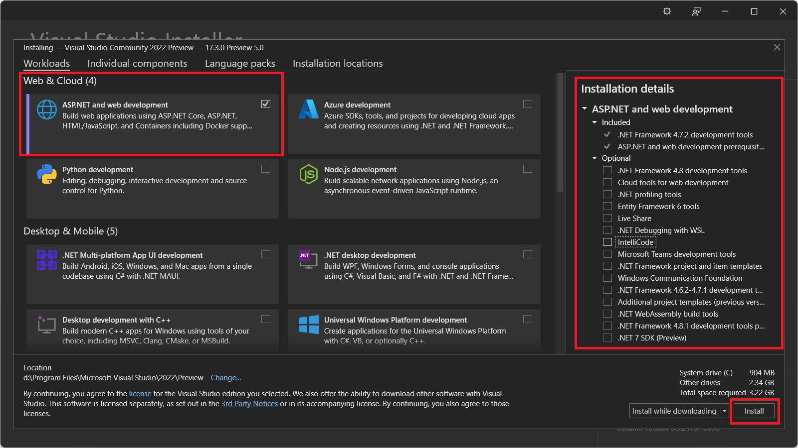

  ## جلسه اول- آموزش نصب Visual Studio
  
  در این جلسه قصد داریم روش نصب Visual Studio را یاد بگیریم، تا از آن در آموزش‌های جلسات بعدی استفاده کنیم

## لیست موضوعات	
1. [آموزش نصب Visual Studio](#InstallVisualStudio)	
	
	
## آموزش نصب Visual Studio   
	
  در ابتدا به آدرس https://visualstudio.microsoft.com/downloads/ می‌رویم و از قسمت Try the preview، گزینه Visual Studio Community را انتخاب می‌کنیم که رایگان است.

 
   فایل دانلود شده را باز و سپس از بین Workloadهای مختلف که برای نوشتن بازی، برنامه های Android / iOS و... است، مطابق عکس فقط تیک ASP.NET and web development را می‌زنیم و از بین گزینه‌های سمت راست، تیک همه موارد را حذف می‌کنیم و سپس Install را می‌زنیم. این پروسه نیاز به دانلود حدودا یک گیگ فایل دارد.

در پایان کار، Visual Studio شما آماده است.

