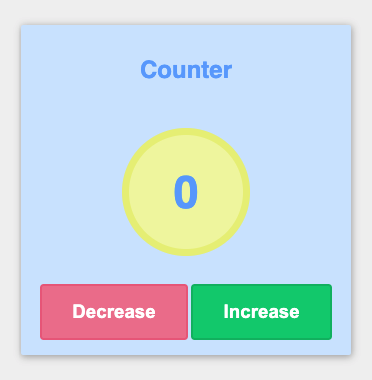
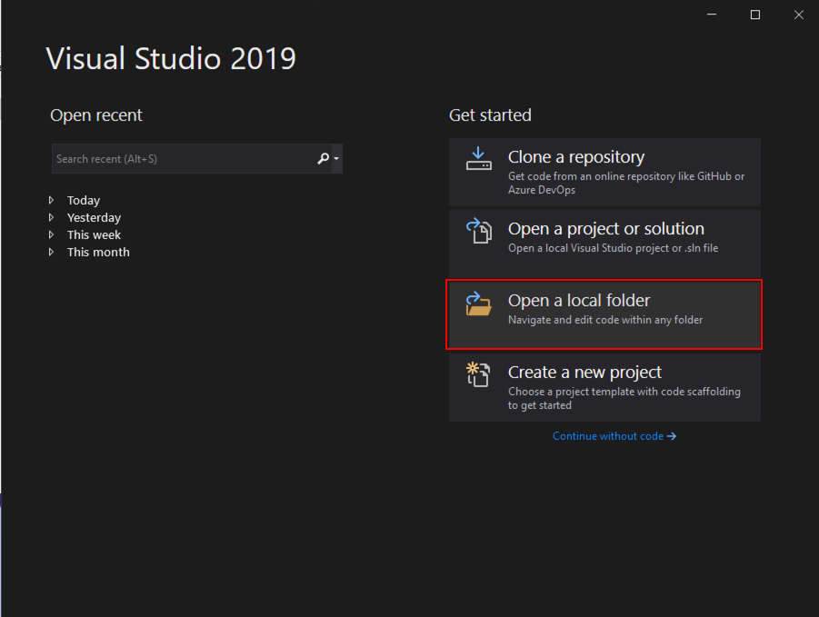
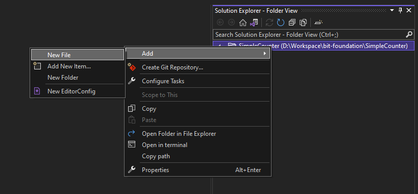
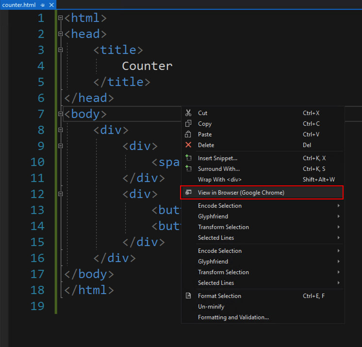
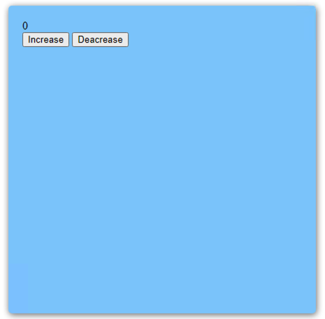
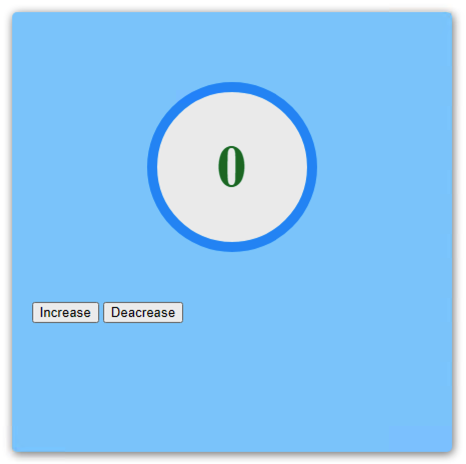
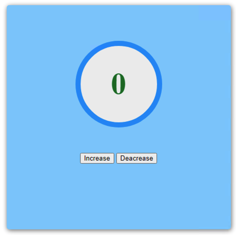
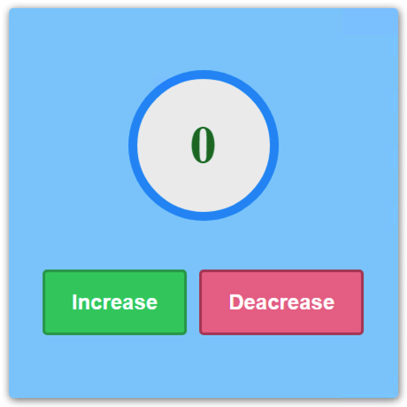
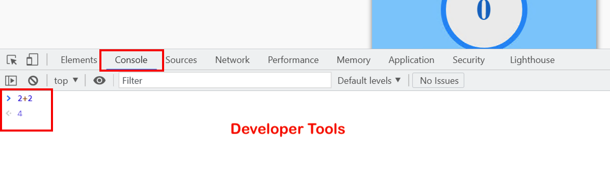
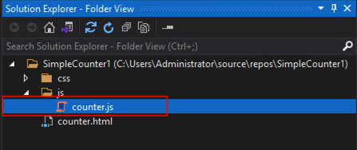

<div dir="rtl">

  ## جلسه دوم- پیاده سازی شمارنده با استفاده از HTML, CSS, JavaScript
  
  در این جلسه قصد داریم شمارنده ای مشابه تصویر زیر پیاده سازی کنیم. هدف ما در این جلسه این است که با انجام یک تمرین ساده شما را با کاربرد  HTML, CSS, JavaScript در صفحات وب آشنا کنیم.



  
  در ابتدا پوشه ای به نام  SimpleCounter  در مسیر دلخواه ایجاد می‌کنیم.

سپس وارد Visual Studio  شده و از قسمت   Get Started  مطابق تصویر زیر روی  گزینه  Open a local folder  کلیک کرده و فولدر مورد نظر را انتخاب می کنیم.

  

 
   مطابق تصویر زیر بعد از وارد شدن به محیط اصلی Visual Studio  در قسمت  Solution Explorer  روی اسم فولدر کلیک راست  و روی گزینه Add کلیک کرده  و در ادامه گزینه NewFile را انتخاب می‌کنیم تا یک فایل جدید ایجاد شود سپس نام فایل را به counter.html تغییر می دهیم.


  
  فایل های HTML معمولا با پسوند html و یا htm مشخص می شوند. با استفاده از کدهای HTML ساختار اصلی صفحات وب را ایجاد می‌کنیم. صفحات HTML شامل انواع المنت ها یا عناصر هستند به عنوان مثال یک صفحه HTML می تواند شامل المنت های text, image, table و…. باشد.
هر عنصر یا المنت HTML توسط یک تگ شروع و یک تگ پایان به صورت زیر تعریف می شود.

  <div dir="ltr">

  ```html
   
   <tagname> Element content </tagname>
   
  ```
  </div>
  
  با استفاده از کدهای HTML  زیر، ساختار شمارنده را ایجاد می‌کنیم. در ادامه به توضیح کوتاهی از هر کدام از تگ های زیر می پردازیم.
  
  <div dir="ltr">

  ```html
   
   <html>
     <head>
        <title>
          Counter
        </title>
     </head>
     
     <body>
      <div>
        <div>
          <span>0</span>
        </div>
        <div>
          <button>Increase</button>
          <button>Decrease</button>
        </div>
      </div>
     </body>
  </html>
   
  ```
  </div>
  
  تگ html المنت اصلی یک صفحه HTML است و مشخص کننده شروع و پایان یک فایل HTML  می باشد.
  
  تگ head بخشی از فایل HTML است که هنگام بارگذاری صفحه در مرورگر وب نمایش داده نمی شود. می تواند شامل تگ title برای مشخص کردن عنوان صفحه و یا تگ های link  برای افزودن فایل‌های external مانند فایل های مربوط به style, script صفحه و .... باشد.
  
  تگ body تمامی مواردی که جنبه نمایش دارند و قرار است به کاربر نشان داده شوند داخل این تگ تعریف می‌شوند.
  
  تگ div برای بخش بندی قسمت‌های مختلف صفحه و یا گروه بندی المنت ها استفاده می‌شود.
  
  تگ span معمولا برای مشخص کردن قسمتی از متن استفاده می‌شود.
  
  تگ button  برای ایجاد دکمه ای که قابلیت کلیک شدن داشته باشه استفاده می‌شود.
  
  به منظور دیدن خروجی کدها با استفاده از ctrl+s  تغییرات را ذخیره و داخل فایل counter.html مطابق تصویر زیر کلیک راست کرده و گزینه  view in Browser  را انتخاب می‌کنیم.
  
	
   
  از این پس هر تغییری که در فایل ها ایجاد کردید ابتدا تغییرات را ذخیره و سپس برا دیدن نتیجه تغییرات، صفحه مرورگر را refresh نمایید.
  
 
فایل‌های CSS با پسوند CSS مشخص می‌شوند. با استفاده از کدهای CSS، نحوه نمایش المنت های HTML  را بر روی صفحه تعیین می‌کنیم.
برای افزودن کدهای CSS به این تمرین ابتدا فایل جدیدی به نام counter.css ایجاد می‌کنیم.
	
و سپس فایل counter.css  رو با استفاده از تگ link داخل تگ head و با استفاده از ویژگی href این تگ، به فایل counter.html اضافه کنیم.
	

<div dir="ltr">

  ```html
  
  <head>
    <title>
      Counter
    </title>
    <link  rel="stylsheet" href="counter.css"/>   
  </head>
    
  ```

</div>
	
الگوی کلی دستورات  CSS  به صورت زیر می‌باشد.


	
		
همانطور که مشاهده می‌کنید دستورات CSS از سه بخش Selector، Property، Property value  تشکیل شده است.

Selector: به منظور اضافه نمودن استایل به یک المنت، باید آن المنت را انتخاب کنیم. یکی از روش های انتخاب المنت در CSS، استفاده از نام خود المنت می‌باشد.
	برای مثال، اگر بنویسیم button، یعنی می‌خواهیم در مورد ظاهر کل buttonها یک سری موارد را اعمال کنیم
	
Property: با استفاده از Property ها، ویژگی‌های نمایش یک المنت در HTML  را تعیین می‌کنیم. مثلا اگر بگوییم Background Color، یعنی می‌خواهیم رنگ زمینه دکمه‌ها را تنظیم کنیم
	
Property value: برای هر Property یا ویژگی در CSS باید یک مقدار در نظر گرفته شود. به عنوان مثال در تصویری که دیدیم، رنگ قرمز را برای پراپرتی color المنت یا تگ p در نظر گرفتیم.
	
و سپس برای نوشتن کدهای css وارد فایل css می‌شویم.

در ابتدا برای تعیین کردن رنگ پس زمینه برای کل صفحه به صورت زیر عمل می کنیم.

<div dir="ltr">

```css

body {
  background-color: #fafafa;
}

```

</div>

در ادامه برای افزودن استایل به المنت‌های دیگر می خواهیم از روش انتخاب المنت با استفاده از ویژگی id المنت استفاده کنیم. بدین ترتیب به فایل counter.html رفته و برای هر کدام از المنت ها، ویژگی id  را با مقدار دلخواه تعیین می کنیم.


<div dir="ltr">

  ```html
  
  <body>
    <div id="card">
      <div id="counter">
        <span id="count">0</span>
      </div>
      <div id="action">
        <button id="increase">Increase</button>
        <button id="decrease">Decrease</button>
      </div>
    </div>
  </body>
    
  ```

</div>
	
اگر ما همچنان از نام خود المنت برای انتخاب المنت استفاده می‌کردیم، پراپرتی‌هایی که به آن المنت اختصاص می‌دادیم تمامی المنت‌ها با آن نام را در صفحه تحت تاثیر قرار می‌داد. به عنوان مثال در این تمرین ما دو دکمه داریم که یکسری از ویژگی‌‌های ظاهری بین آنها مشترک هستند مانند اندازه دکمه‌ها که ما می توانیم همچنان از نام خود المنت (button) برای انتخاب المنت استفاده کنیم اما یک سری از ویژگی‌ها مانند رنگ پس‌زمینه هر دکمه با دکمه بعدی متفاوت می‌باشد که در اینجا باید از یک Selector یا انتخاب‌گر دیگر مانند id برای انتخاب المنت مورد نظر استفاده کنیم.

برای انتخاب المنت با استفاده از نام id از " # "  قبل از نوشتن نام selector استفاده می‌کنیم.

<div dir="ltr">

```css

#card {
  Padding: 20px;  /* .برای تعیین  فاصله المنت از محتوای درون المنت استفاده می‌شود */
  Margin: 200px auto; /* .برای تعیین فاصله المنت از محتوای بیرون از المنت استفاده می‌شود */ 
  Width: 400px;  /* .برای تعیین عرض المنت استفاده می‌شود */
  Height: 400px;  /* .برای تعین ارتفاع المنت استفاده می‌شود */
  Background-color: lightskyblue;  /* .برای تعیین رنگ پس زمینه المنت استفاده می‌شود */
  Box-shadow: 1px 2px 10px 0 #808080;  /* .برای افزودن سایه به المنت مورد نظر استفاده می‌شود */
  Border-radius: 5px;  /* .باافزودن شعاع به گوشه‌های یک المنت که در نهایت موجب خمیدگی آن گوشه می‌شود */
}


```

</div>

هر کدام از پراپرتی‌های padding و margin حداکثر چهار عدد را می‌توانند به عنوان مقدار بگیرند که این چهار عدد به ترتیب نشان دهنده فاصله از بالا، راست، پایین و چپ می‌باشند. اگر فقط یک مقدار به هر کدام از این property ها اختصاص دهیم به این معنی است که هر چهار طرف فاصله‌ای یکسان را نسبت به محتوای بیرون از المنت و یا محتوای درون المنت را دارند و اگر دو مقدار اختصاص دهیم به این معنی است که عدد اول مربوط به فاصله از بالا و پایین المنت، و عدد دوم مربوط به فاصله از چپ و راست المنت می‌باشد.
اختصاص دادن مقدار auto  به جای عدد دوم به پراپرتی  margin  به این معنی است که المنت ما از سمت چپ و راست در قسمت وسط قرار می‌گیرد.

		

<div dir="ltr">

```css

#counter {
  margin: 50px auto; 
  width: 150px;
  height: 150px;
  line-height: 150px; /* .متن داخل المنت به اندازه مقداری که داده شده از خط قبل و بعد فاصله می‌گیرد */
  background-color: #eee;
  border-radius: 50%;  /* .با دادن این مقدار به این پراپرتی المنت دایره‌ای شکل می‌شود */
  border: 10px solid #2196f3; /* .استایل، عرض و رنگ حاشیه المنت را مشخص می‌کند  */
  text-align: center;  /* .نحوه چیدمان متن داخل المنت را مشخص می‌کند */
  font-size: 60px;  /* .سایز فونت متن داخل المنت را مشخص می‌کند */
  Font-weight: bold;  /* .ضخامت متن داخل المنت را مشخص می‌کند */
  color: #107732;  /* .رنگ متن داخل المنت را مشخص می‌کند */
}


```

</div>
	
	
	
<div dir="ltr">

```css

#action {
  text-align: center; 
}


```

</div>	
	
		

	
<div dir="ltr">

```css

button {
  padding: 20px 30px;
  margin: 5px;
  font-size: 24px;
  font-weight: bold;
  border-radius: 5px;
  cursor: pointer; /* .زمانی که با موس روی دکمه‌ها می‌رویم اشاره گر ماوس به شکل دست در می‌یاید */
  color: white;  
}

#increase {
  background-color: #18cd73;
  border: 3px solid #19a35d;
}

#decrease {
  background-color: #ef7694;
  border: 3px solid #b74b66;
}

```

</div>	
	
	

به منظور این که به صفحات وب عملکردی را اضافه کنیم، مثلا در این تمرین، زمانی که روی دکمه increase  کلیک کردیم یه واحد به عدد اضافه و زمانی که روی دکمه decrease کلیک کردیم یک واحد از عدد کم شود، از کدهای JavaScript استفاده می‌کنیم. 
بدین ترتیب فایل جدیدی به نام  counter.js ایجاد می‌کنیم.
در ادامه ابتدا باید فایل  counter.js را به فایل counter.html اضافه کنیم. به فایل counter.html رفته و در انتهای تگ head یک تگ script اضافه می کنیم. با استفاده از ویژگی src این تگ آدرس فایل  counter.js  را مشخص می‌کنیم.


<div dir="ltr">

  ```html
  <head>
    <script src="counter.js"></script>
  </head>
  <body>
    <div id="card">
      <div id="counter">
	      <span id="count">0</span>
      </div>
      
      <div id="action">
        <button id="increase">Increase</button>
        <button id="decrease">Decrease</button>
      </div>
    </div>
  </body>
    
  ```

</div>

برای نوشتن کدهای JavaScript به فایل counter.js  رفته و در ابتدا یک متغیر به نام val تعریف می‌کنیم و سپس مقدار document.querySelector('#count') را  به صورت زیر به آن اختصاص می‌دهیم.
در اینجا let یک کلمه کلیدی است که برای تعریف کردن متغییر استفاده می‌شود. متغییر می‌تواند حاوی هر مقداری باشد، که در اینجا ما قصدمان داشتن متغییری است که به المنت #count اشاره می‌کند، که در ادامه بتوانیم با کلیک بر روی دکمه‌های Increase و Decrease، مقدار داخل آنرا کم و زیاد کنیم.

<div dir="ltr">

  ```js
  
  let val = document.querySelector('#count');
    
  ```

</div>

سپس صفحه مرورگر را refresh کرده روی صفحه کلیک راست و گزینه‌ی inspect  را انتخاب کنید. محیطی که با انتخاب این گزینه برای شما باز می‌شود محیط developer tools  نام دارد. سپس وارد تب console  شوید. در تب console می‌توانید دستوراتی را نوشته و خروجی آنها را ببینید. برای مثال با نوشتن 2 + 2 و زدن دکمه Enter، می‌توانید جواب را که برابر 4 هست ببینید.
به علاوه، خطاهایی که ممکن است در هنگام کار با برنامه رخ دهند را نیز در اینجا می‌توانید مشاهده کنید.
	

	
صفحه مرورگر خود را در همین حالت نگه داشته و مجددا به فایل counter.js  رفته و خط زیر را به این فایل اضافه نمایید.
	

<div dir="ltr">

  ```js
  
  console.log (val)
    
  ```

</div>

مجددا صفحه مرورگر را refresh نمایید همان طور که می‌بینید مقداری که داخل متغیر  val قرار گرفته در قسمت console چاپ شده است.


	

در واقع با استفاده از متد querySelector المنت مورد نظر را در JavaScript  انتخاب و به متغیر val اختصاص داده‌ایم.

نکته: هر متد، یک بلاک کد از پیش تعریف شده است که به منظور انجام وظیفه ای خاص مانند تبدیل یک مقدار به یک رشته و یا انتخاب یک المنت و … تعیین شده است. 

از (console.log (val  صرفا برای متوجه شدن مقدار داخل متغیر  val استفاده کردیم و در ادامه کار احتیاجی به آن نداریم بنابراین این خط از کد را پاک می‌کنیم.

در ادامه باید دو تابع یا function  برای اضافه کردن و کم کردن از عدد بنویسیم.

<div dir="ltr">

  ```js
  
  function Increase() {
	  val.textCountent++ ; 
  }
    
  ```

</div>

از متد  textContent  برای دسترسی به عدد داخل المنت استفاده می‌کنیم. با استفاده از عملگر " ++ " یک واحد به این عدد افزوده و با استفاده از عملگر " -- " یک واحد از این عدد کم می‌کنیم.

<div dir="ltr">

  ```js
  
  function Decrease() {
	  val.textCountent-- ;
  }
  
  ```

</div>

در نهایت هر function باید یک جایی فراخوانی شود در این تمرین ما در نظر داشتیم با کلیک بر روی هر دکمه (افزایش یا کاهش عدد) انجام شود برای این منظور به فایل  counter.html  برمی گردیم و روی رویداد onclick هر کدام از button ها function مربوطه را به صورت زیر فراخوانی می‌کنیم.

<div dir="ltr">

  ```html
  
  <div class="action">
    <button id="increase" onclick="increase()">Increase</button>
    <button id="decrease" onclick="decrease()">Decrease</button>
  </div>
    
  ```

</div>
	
تغییرات را ذخیره و به مرورگر برمی‌گردیم. خروجی نهایی به صورت زیر می‌باشد.
	


</div>

