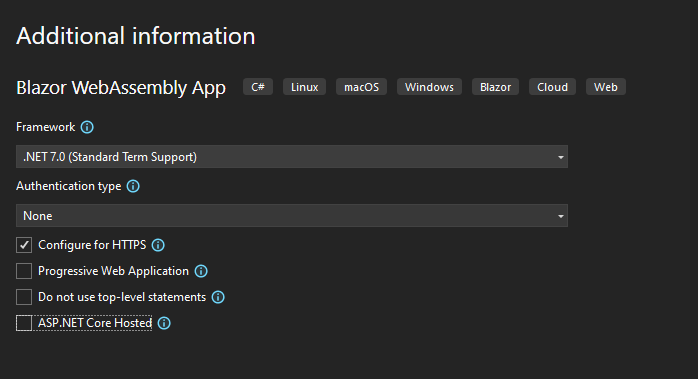

<div dir="rtl">

  ## جلسه سوم- پیاده سازی شمارنده با استفاده از  Blazor
  
 در این جلسه قصد داریم شمارنده جلسه پیش را با استفاده از Blazor  پیاده سازی کنیم. 

  
  <details><summary>آماده سازی پروژه Blazor در Visual Studio</summary>
  وارد محیط Visual Studio  شده و از قسمت Get started روی گزینه Create a new project به منظور ایجاد پروژه جدید کلیک می‌کنیم. 
  
  
  

 در مرحله بعد مطابق تصویر زیر از لیست ارایه شده ‌Blazor WebAssembly App را انتخاب و با کلیک بر روی دکمه Next به مرحله بعدی می‌رویم.
  
  
  
   همان طور که در تصویر زیر می‌بینید در قسمت Project name می‌توانیم اسم پروژه را تعیین کنیم (در این قسمت اسم پروژه را SimpleBlazorCounter می‌گذاریم) و در قسمت Location محل قرار گیری پروژه را مشخص کنیم. مجددا برای رفتن به مرحله بعد بر روی دکمه Next کلیک می‌کنیم.

 
 
 مطابق تصویر زیر، در این مرحله دقت کنید که Target Framework حتما روی (Net 5.0 (current قرار گرفته باشد.
 
 
 
 با کلیک بر روی دکمه Create پروژه SimpleBlazorCounter ایجاد می‌شود.
 
 همان طور که می بینید در سمت راست محیط  Visual Studio  ما بخش Solution Explorer  را داریم. با توجه با این نکته که ما Blazor WebAssembly App  را انتخاب کردیم ساختار فایلی که اینجا می‌بینیم مربوط به ساختار پیش فرض Blazor می‌باشد. در ابتدا ما توضیحی کوتاه و مختصر در مورد این ساختار داده و سپس بنا بر نیاز تمرین فعلی این ساختار را تغییر می‌دهیم. 
 
 
 
 
 همانطور که در تصویر بالا می‌بینید ما داخل پروژه SimpleBlazorCounter به ترتیب پوشه‌های زیر را داریم.

پوشه Properties، داخل این پوشه یک فایل به نام launchSettings.json قرار گرفته که تنظیمات مربوط به راه اندازی سرور برنامه درآن است.


پوشه wwwroot، در این پوشه فایل های استاتیک مانند فایل های css ,font ,image و… قرار دارند. 

پوشه Pages، در این پوشه صفحات پروژه  با پسوند razor قرار گرفته‌اند. داخل فایل‌های razor می‌توانیم کدهای HTML را بنویسم و از برخی از امکانات #C استفاده کنیم.

پوشه Shared، با این پوشه، فعلا کاری نداریم، بنابراین حذفش می‌کنیم و در آینده به طور کامل در مورد این پوشه توضیح می‌دهیم.

توضیحات در مورد ساختار فایل‌های پروژه برای این جلسه کافی است. همان طور که گفتیم طبق نیاز تمرین این جلسه ساختار فعلی را تغییر می دهیم.

ابتدا از پوشه Properties فایل launchSettings.json را انتخاب و کد زیر جایگزین کدهای موجود در این فایل می‌کنیم.

<div dir="ltr">

  ```json

{
  "profiles": {
    "SimpleBlazorCounter": {
      "commandName": "Project",
      "dotnetRunMessages": "true",
      "launchBrowser": true,
      "launchUrl": "counter",
      "inspectUri": "{wsProtocol}://{url.hostname}:{url.port}/_framework/debug/ws-proxy?browser={browserInspectUri}",
      "applicationUrl": "https://localhost:5001;http://localhost:5000",
      "environmentVariables": {
        "ASPNETCORE_ENVIRONMENT": "Development"
      }
    }
  }
}
  ```
</div>

سپس از پوشه wwwroot پوشه های css ،sample-data و فایل favicon.ico رو حذف کرده به این صورت که روی نام فایل کلیک راست و از منوی باز شده گزینه Delete را انتخاب می‌کنیم. 

در ادامه کدهای مربوط به فایل index.html رو به صورت زیر تغییر می‌دهیم.


<div dir="ltr">

  ```html
   
    <!DOCTYPE html>
    
    <html>
      <head>
          <meta charset="utf-8" />
          <meta name="viewport" content="width=device-width, initial-scale=1.0, maximum-scale=1.0, user-scalable=no" />
          <title>SimpleBlazorCounter</title>
          <link href="SimpleBlazorCounter.styles.css" rel="stylesheet" />
      </head>

      <body>
          <div id="app">Loading...</div>
          <script src="_framework/blazor.webassembly.js"></script>
      </body>
    </html>
  ```
</div>

از پوشه pages  هم فایل های FetchData.razor و Index.razor  را هم حذف می‌کنیم.
 و همین طور پوشه Shared را هم حذف نمایید.
در ادامه در فایل Imports.razor_ ، به دلیل اینکه پوشه  Shared را از قبل حذف کرده ایم، خط  زیر را هم حذف می‌کنیم.

<div dir="ltr">

  ```razor
    @using SimpleBlazorCounter.Shared
  ```
</div>

کدهای داخل فایل App.razor  را هم به کد زیر تغییر می دهیم.

<div dir="ltr">

  ```razor
    
    <Router AppAssembly="@typeof(Program).Assembly" PreferExactMatches="@true">
        <Found Context="routeData">
            <RouteView RouteData="@routeData"/>
        </Found>
        <NotFound>
            <LayoutView>
                <p>Sorry, there's nothing at this address.</p>
            </LayoutView>
        </NotFound>
    </Router>
  ```
</div>


برای مطمئن شدن از درستی تغییر ساختار با استفاده " ctrl+f5 "  پروژه را اجرا می‌کنیم.
به دلیل این که از قبل و به صورت پیش فرض ما یک سری کد داخل فایل Counter.razor  داشتیم خروجی که در مرورگر می‌بینیم مطابق تصویر زیر است.

  
  
</details>

<details><summary>افزودن کد های HTML</summary>  
  برای ایجاد شمارنده‌‌ای مطابق جلسه پیش، اما این بار با استفاده از ‌Blazor به این صورت عمل می‌کنیم.

ابتدا از پوشه Pages فایل Counter.razor را انتخاب می‌کنیم.  ساختار کلی Blazor به این صورت است که کدهای Blazor‌ با @ مشخص می‌شوند. و بلاک های کد با code@ نوشته می‌شوند.

کدهای HTML جلسه گذشته را به صورت زیر، جایگزین کدهای HTML این فایل می‌کنیم.


  <div dir="ltr">

  ```razor
    
    @page "/counter"

    <div class="card">
        <div class="counter">
            <span id="count">0</span>
        </div>
        <div class="action">
            <button class="increase" onclick="Increase()">
                Increase
            </button>
            <button class="decrease" onclick="Decrease()">
                Deacrease
            </button>
        </div>
    </div>

    @code {
        private int currentCount = 0;

        private void IncrementCount()
        {
            currentCount++;
        }
    }

  ```
</div>
  
  دقت کنید که خط اول این فایل که مسیر این فایل را در مرورگر مشخص می کند همچنان بدون تغییر باقی می‌ماند.


</details>
  
<details><summary>افزودن کد های CSS</summary>    
برای افزودن کدهای css، روی پوشه pages  کلیک راست کرده، گزینه Add  را انتخاب و سپس گزینه NewItem را انتخاب می‌نماییم.


مطابق تصویر زیر از لیست ارائه شده Style Sheet  را انتخاب و در قسمت Name نامی مشابه نام Component که در اینجا Counter.razor نام دارد با پسوند css. انتخاب می کنیم.
اسم فایل Counter.razor.css می‌باشد. سپس روی دکمه Add کلیک نمایید.


فایل Counter.razor.css مشابه تصویر زیر به پروژه اضافه می‌شود.


کدهای CSS را از فایل CSS جلسه گذشته کپی و در فایل Counter.razor.css وارد می‌کنیم.  


<div dir="ltr">

```css
.card {
 padding: 20px;
 margin: 200px auto;
 width: 400px;
 height: 400px;
 background-color: lightskyblue;
 box-shadow: 1px 2px 10px 0 #808080;
}
 
.counter {
 margin: 50px auto;
 width: 150px;
 height: 150px;
 line-height: 150px;
 background-color: #eee;
 border-radius: 50%;
 border: 10px solid #2196f3;
 text-align: center;
 font-size: 60px;
 font-weight: bold;
 color: #1077c2;
}
 
.action {
 text-align: center;
}
 
button {
 padding: 20px 30px;
 margin: 5px;
 font-size: 24px;
 font-weight: bold;
 border-radius: 5px;
 cursor: pointer;
 color: white;
}
 
.increase {
 background-color: #18cd73;
 border: 3px solid #19a35d;
}
 
.decrease {
 background-color: #ef7694;
 border: 3px solid #b74b66;
}

```
</div>

خروجی تغییرات در مرورگر مشابه تصویر زیر می‌باشد.


</details>
  
<details><summary>افزودن رفتار تعاملی با استفاده از #C</summary>  
در ادامه به جای افزودن کدهای Javascript برای تعیین عملکرد دکمه‌ها، از کدهای #C  استفاده می‌کنیم. 
کدهای #C  را می‌توانیم داخل بلاک code@، فایل Counter.razor بنویسیم. اما بهتر است بلاک code@ را از این فایل حذف کرده و یک فایل جدید به نام Counter.razor.cs از طریق Add > Class  < راست کلیک روی پوشه Pages، ایجاد و کدهای زیر را وارد این فایل کنیم.

  <div dir="ltr">

  ```c#
    using System;
    using System.Collections.Generic;
    using System.Linq;
    using System.Threading.Tasks;

    namespace SimpleBlazorCounter.Pages
    {
        public partial class Counter
        {
            public int CurrentCount { get; set; }

            public void Increase()
            {
                CurrentCount++;
            }

            public void Decrease()
            {
                CurrentCount--;
            }
        }
    }

  ```
</div>

  همان طور که می بینید در کلاسی به نام Counter یک پارامتر به نام CurrentCount از نوع int که نوع عددی می باشد را تعیین کرده‌ایم. همچنین دو متد به نام‌های Increase و Decrease که همانند جلسه گذشته، زمانی که فراخوانی می‌شوند، یک واحد به عدد ما افزوده و یا کم می‌کنند.

سپس مجددا وارد فایل Counter.razor  شده و نحوه فراخوانی متدها را تغییر می‌دهیم چرا که باید از سینتکس ‌‌Blazor که با @ مشخص میشوند استفاده کنیم.

همچنین به جای عدد صفر از نام متغیر CurrntCount استفاده می کنیم تا هر تغییر که روی عدد جاری اعمال شد مستقیما در این قسمت نمایش داده شود.

نحوه فراخوانی هر تابع روی رویداد onclick دکمه مربوطه و استفاده از نام متغیر به جای عدد مطابق کد زیر تغییر می‌کند.

  <div dir="ltr">

  ```html
  <div id="card">
      <div class="counter">
          <span id="count">@CurrentCount</span>
      </div>
      <div class="action">
          <button class="increase" @onclick="Increase">
              Increase
          </button>
          <button class="decrease" @onclick="Decrease">
              Deacrease
          </button>
      </div>
  </div>

  ```
</div>

نتیجه نهایی تغییرات به صورت زیر می‌باشد.


</details>  
</div>
