<div dir="rtl">
  
## جلسه چهارم - پیاده سازی ماشین حساب در Blazor
  
در این جلسه قصد داریم یک ماشین حساب ساده مطابق تصویر زیر با استفاده از Blazor پیاده سازی کنیم.

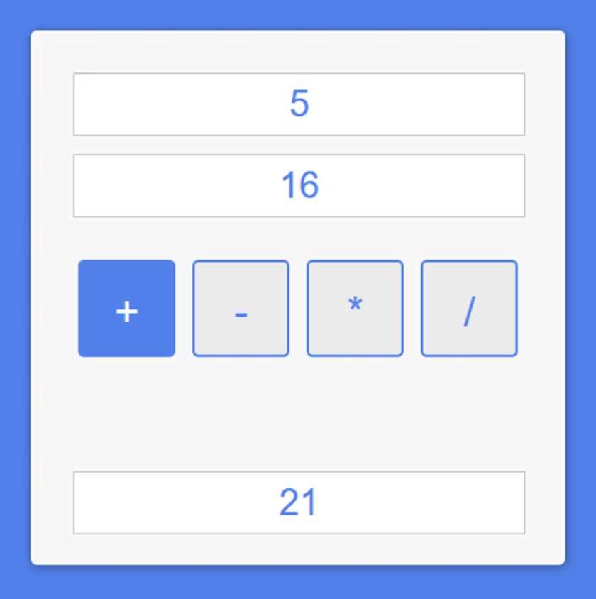

## لیست موضوعات
1. [ایجاد پروژه در Visual Studio](#CreateProject)
2. [ایجاد ساختار اصلی](#CreateMainStructure)  
3. [افزودن استایل بااستفاده از SCSS](#AddSCSS)  
4. [افزودن رفتار تعاملی با استفاده از #C](#AddFunctionality)  

## ایجاد پروژه در Visual Studio <a name="CreateProject"></a>  
همانند جلسه گذشته پروژه جدیدی به نام SimpleBlazorCalculator ایجاد کرده و مجددا فایل‌ها و پوشه‌های اضافی را مطابق جلسه گذشته حذف کنید. با دو تفاوت:
همه صفحات موجود در پوشه Pages را پاک کنید.
اگر از کدهای جلسه قبل استفاده می‌کنید، SimpleBlazorCounter را در هر جایی که کد را کپی کردید، با SimpleBlazorCalculator جایگزین کنید.

  
داخل پوشه Pages راست کلیک نموده و از منوی Add، گزینه New Itemو بعد گزینه Razor Component را زده و اسم آن را Calculator.razor بگذارید.

  
وارد فایل Calculator.razor شده و در ابتدای این فایل کد زیر را برای تعیین مسیر این صفحه در مرورگر وارد کنید و در launchSettings.json نیز مقدار launchUrl را برابر با calculator قرار دهید.

<div dir="ltr">

  ```razor
  
  @page "/calculator"
  
  ```
</div>

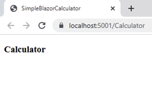

  
## ایجاد ساختار اصلی <a name="CreateMainStructure"></a>
 برای ایجاد ساختار اولیه ماشین حساب کد زیر را در فایل Calculator.razor  وارد کنید.

<div dir="ltr">

  ```html
  
    
<div class="container">
  <div class="card">
      <div class="field">
          <input type="text" placeholder="0"/>
      </div>
      <div class="field">
          <input type="text" placeholder="0"/>
      </div>
      <div class="action">
          <button class="btn">+</button>
          <button class="btn">-</button>
          <button class="btn">*</button>
          <button class="btn">/</button>
      </div>
      <div class="field result">
          <input type="text" placeholder="0" readonly/>
      </div>
  </div>
</div>


  
  ```
</div>

از تگ‌های Input برای گرفتن دیتا از کاربر در صفحات وب استفاده می‌شود. به دلیل گستردگی در انواع داده‌ها، انواع متفاوتی از تگ‌های input وجود دارد که نوع آنها با استفاده ویژگی type این تگ، مانند موارد زیر مشخص می‌شود.

<div dir="ltr">

  ```html
  
  <input type="number">
  <input type="password">
  <input type="tel">
  <input type="text">(default value)
  <input type="url">
  
  ```
</div>
  
ویژگی placeholder در input می‌تواند شامل یک متن خیلی کوتاه باشد که اشاره به مقدار مورد انتظار یک المنت دارد.

در این تمرین همانطور که مشاهده می‌کنید ازدو تگ input برای گرفتن دو عدد از کاربر استفاده می‌کنیم.
و همچنین از یک تگ input با ویژگی readonly به معنای این که محتوای این تگ قابل تغییر نیست و فقط قابل خواندن است، برای نتیجه نهایی استفاده می‌کنیم.

  
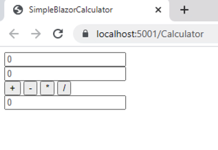

## افزودن استایل بااستفاده از SCSS <a name="AddSCSS"></a>
از این جلسه به بعد برای افزودن استایل‌ها از SCSS به جای CSS استفاده می‌کنیم. SCSS علاوه بر داشتن تمامی ویژگی های موجود در CSS شامل تعدادی ویژگی‌ قدرتمندتر نیز نسبت به CSS می‌باشد، که با استفاده از این ویژگی‌ها نوشتن استایل‌ها آسان‌تر، سریعتر و خواناتر می‌شود.
  
سعی ما بر این است که به مرور زمان از این جلسه تا جلسه آخر این دوره، به توضیح کامل این ویژگی‌ها با مثال‌های متعدد بپردازیم.  

زمانی که از فایل‌ها  با پسوند SCSS استفاده می‌کنیم باید آنها را به فایل  با پسوند CSS تبدیل کنیم تا برای مرورگر قابل فهم باشد. در واقع زمان استفاده از SCSS احتیاج به یک کامپایلر داریم تا فایل‌های SCSS  پروژه را به CSS کامپایل کند. برای انجام این کار، ابزار و روش‌های متفاوتی وجود دارد که در ادامه به بررسی یکی از این ابزارها می‌پردازیم.

در ابتدا مطابق تصویر زیر از بخش Solution Explorer بر روی Dependencies کلیک راست کرده و از منوی باز شده گزینه Manage NuGet Packages را انتخاب می‌کنیم.

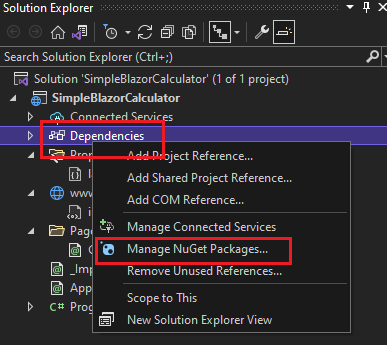

در فایل باز شده تب ‌‌Browse را انتخاب و در قسمت سرچ باکس Delegate.SassBuilder را جستجو می‌کنیم.

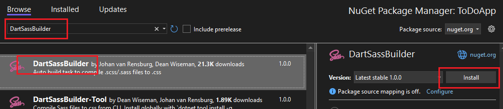

و سپس از لیست ارائه شده Delegate.SassBuilder را انتخاب و از سمت راست بر روی دکمه Install  کلیک می‌کنیم.
  
  
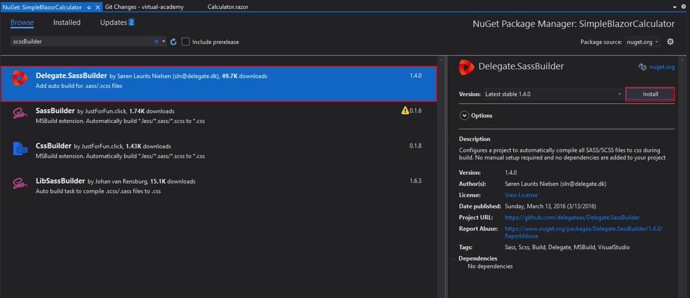
  

در نهایت بر روی دکمه Ok کلیک می‌کنیم تا این Package نصب شود.
   

بعد از نصب  Delegate.SassBuilder بر روی پوشه Pages در بخش Solution Explorer کلیک راست کرده و فایل جدیدی به نام Calculator.razor.scss ایجاد می‌کنیم.


 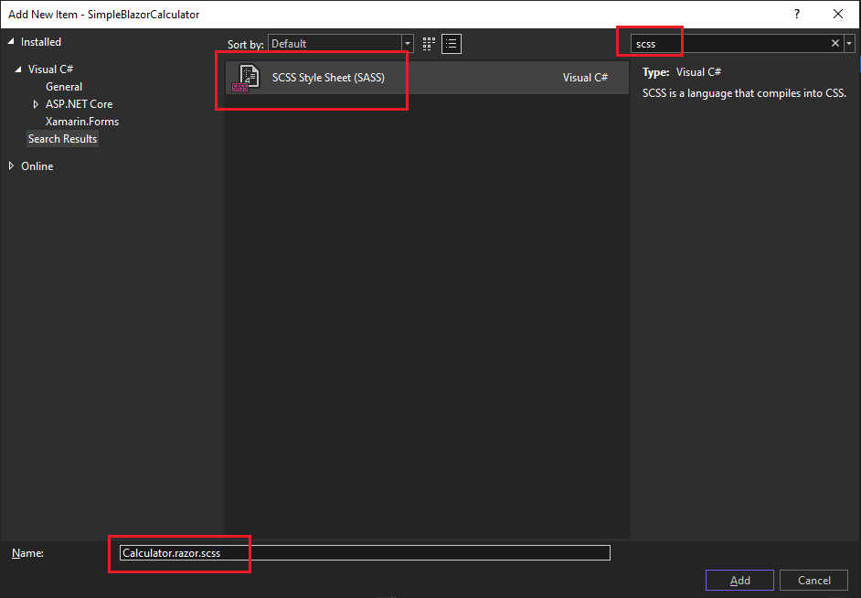 


در همین مرحله اگر پروژه را اجرا کنیم، می‌بینیم که فایل کامپایل شده با پسوند CSS به فایل‌های مربوط به کامپوننت Calculator اضافه می‌شود. 


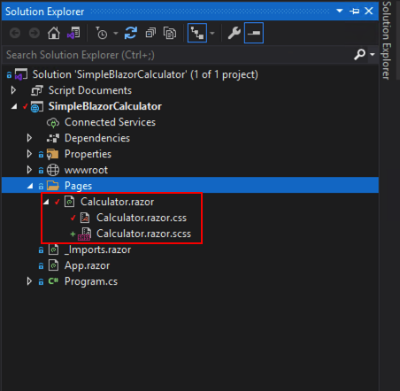 
  

هدف ما از بخش استایل‌ها در این جلسه، آشنایی شما با ویژگی Variable در SCSS می‌باشد.

 فرض نمایید در فایل مربوط به استایل‌ها ما چندین بار از رنگ آبی استفاده کردیم، بعد از مدتی تصمیم میگیریم این رنگ آبی، به عنوان مثال به رنگ آبی روشن تر تغییر کند. اگر از Variableها استفاده نکنیم مجبوریم تمامی رنگ‌های آبی موجود در فایل‌ها را به صورت دستی تغییر دهیم اما با استفاده از Variable ها ما تنها مقدار متغیر مربوط به رنگ آبی را تغییر می‌دهیم، بدین ترتیب تمامی پراپرتی‌ها که متغیر مربوط به رنگ آبی را به عنوان مقدار داشته‌اند، رنگ جدیدی را که به متغیر نسبت داده ایم به خود می‌گیرند.
  
به منظور تعریف متغیرها در SCSS  از کاراکتر $ قبل از نام متغیر استفاده می‌کنیم. بدیهی است که نام متغیر می‌تواند هر آنچه که شما می‌خواهید باشد.

کد زیر را copy و در فایل paste ،Calculator.razor.scss نمایید.
  

<div dir="ltr">

  ```scss
  
// Variables
//
// Color system
$light-blue: cornflowerblue !default;
$light-gray: #dcdcdc !default;

// Font
$font-family: "Segoe UI", Roboto, Arial, sans-serif !default;

.card {
    margin: 120px auto;
    padding: 20px;
    width: 400px;
    height: 400px;
    background-color: $light-blue;
    border-radius: 5px;
    box-shadow: 1px 2px 10px 0 $light-gray;
}

.field {
    margin: 15px
}

input {
    padding: 10px;
    width: 350px;
    height: 30px;
    color: $light-blue;
    border: 2px solid $light-gray;
    text-align: center;
    font-family: $font-family;
    font-size: 30px;
}

.action {
    margin: 30px 0;
    text-align: center;
}

.result {
    margin-top: 75px;
}

.btn {
    margin: 5px;
    width: 80px;
    height: 80px;
    border-radius: 5px;
    background-color: $light-gray;
    line-height: 80px;
    color: $light-blue;
    font-size: 35px;
    cursor: pointer;
}
  
  ```
</div>
    
 خروجی تمرین، تا این مرحله به صورت تصویر زیر می باشد.


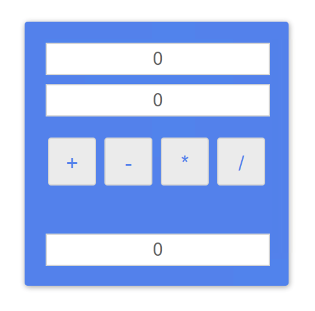

  
## افزودن رفتار تعاملی با استفاده از #C <a name="AddFunctionality"></a>
سپس فایل جدیدی به نام Calculator.razor.cs به منظور نوشتن متدها، برای چهار عمل اصلی (جمع، تفریق، ضرب، تقسیم) ایجاد می‌کنیم و کدهای زیر را وارد این فایل می‌کنیم.
  
<div dir="ltr">

  ```c#
using System;
using System.Collections.Generic;
using System.Linq;
using System.Threading.Tasks;

namespace SimpleBlazorCalculator.Pages
{
    public partial class Calculator
    {
        public decimal Num1 { get; set; }

        public decimal Num2 { get; set; }

        public string FinalResult { get; set; }
  

        public void AddNumbers()
        {
            FinalResult = (Num1 + Num2).ToString("0.##");
        }

        public void SubtractNumbers()
        {
            FinalResult = (Num1 - Num2).ToString("0.##");
        }

        public void MultiplyNumbers()
        {
            FinalResult = (Num1 * Num2).ToString("0.##");
        }

        public void DivideNumbers()
        {
            if (Num2 != 0)
            {
                FinalResult = (Num1 / Num2).ToString("0.##");
            }
            else
            {
                FinalResult = "Cannot Divide by Zero";
            }
        }
    }
}


  ```
</div>

همانطور که در کد بالا می‌بینید داخل کلاس Calculator،  از سه پارامتر از نوع decimal استفاده می‌کنیم که پارامترهای Num1 و Num2 قرار است دو عددی که از کاربر دریافت می‌کنیم را داخل خود نگه دارند و پارامتر FinalResult  نتیجه نهایی را در خود نگه می‌دارد.

نوع decimal و یا ده‌دهی زمانی مناسب است که درجه دقت مورد نیاز، توسط تعداد ارقام سمت راست نقطه اعشاری تعیین شود. این اعداد معمولاً در برنامه های مالی ، برای مبالغ ارزی (به عنوان مثال ، 1.00 دلار) ، نرخ بهره (به عنوان مثال ، 2.625٪) و غیره استفاده می شود.

چهار متد هم به نام‌های AddNumbers، SubtractNumbers، MultiplyNumbers، DivideNumbers برای  چهار عمل اصلی داریم.

در داخل هر متد بعد از اعمال عملگر بر روی دو عدد، از متد ()ToStrin برای تبدیل نتیجه که به صورت decimal می‌باشد به string استفاده می کنیم و در نهایت داخل پارامتر FinalResult  قرار می‌دهیم.


برای نمایش اعشار تا دو رقم از ToString("0.##") استفاده می‌کنیم.

در متد DivideNumbers از یک شرط استفاده می کنیم چرا که در تقسیم اعداد، تقسیم یک عدد بر صفر تعریف نشده است. به همین منظور می‌توانیم با قرار دادن یک شرط، به این صورت که اگر عدد دوم مخالف صفر بود عمل تقسیم انجام و در غیر این صورت پیغام مناسب را به کاربر نمایش دهد، خروجی درست را به کاربر نمایش دهیم.
  
الگوی کلی دستورات شرطی if به صورت زیر ‌می‌باشد.
  
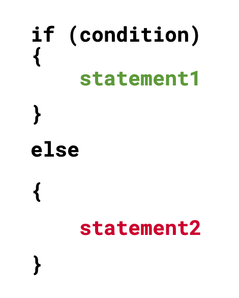
  
  به منظور استفاده از ساختار شرطی از کلمه کلیدی if استفاده می‌کنیم. در داخل پرانتز شرط مورد نظر را نوشته، در صورت صحت شرط تعیین شده، مجموعه‌ای از دستورات در بلاک کد اول، اجرا و در غیر این صورت بعد از کلمه کلیدی else مجموعه دستورات در بلاک کد دوم، اجرا می‌شوند.

در مرحله بعد باید هر متد را بر روی رویداد onclick دکمه مربوطه فراخوانی کنیم. 
بدین ترتیب مجددا وارد فایل Calculator.razor شده و تغییرات زیر را بر روی کد اعمال می‌کنیم.

<div dir="ltr">

  ```html

  <div class="container">
    <div class="card">
        <div class="field">
            <input type="text" placeholder="0" />
        </div>

        <div class="field">
            <input type="text" placeholder="0" />
        </div>

        <div class="action">
            <button class="btn" @onclick="AddNumbers">+</button>
            <button class="btn" @onclick="SubtractNumbers">-</button>
            <button class="btn" @onclick="MultiplyNumbers">*</button>
            <button class="btn" @onclick="DivideNumbers">/</button>
        </div>

        <div class="field result">
            <input type="text" placeholder="0" readonly />
        </div>
    </div>
  </div>
  
  ```
</div>

با استفاده از ویژگی bind@ در ‌Blazor می‌توانیم مقادیر متغیرهای (Num1, Num2, FinalResult) مربوط به هر input را به آنها نسبت دهیم. 
 
 در واقع ما یک اتصال داده بین متغیرها در کلاس calculator و این  input ها ایجاد می‌کنیم. بدین ترتیب زمانی که کاربر اعداد را وارد می‌کند، مقادیر داخل متغیرهای Num1 و Num2 نشسته و در مقابل مقدار متغیر FinalResult را به input  سوم نسبت می‌دهیم و با هر تغییری در این متغیر مقدار input بروزرسانی می‌شود.

برای اعمال ویژگی bind@ کد را به صورت زیر تغییر دهید. 
 
<div dir="ltr">

  ```html

  <div class="container">
    <div class="card">
        <div class="field">
            <input type="text" placeholder="0" @bind="@Num1"/>
        </div>

        <div class="field">
            <input type="text" placeholder="0" @bind="@Num2"/>
        </div>

        <div class="action">
            <button class="btn" @onclick="AddNumbers">+</button>
            <button class="btn" @onclick="SubtractNumbers">-</button>
            <button class="btn" @onclick="MultiplyNumbers">*</button>
            <button class="btn" @onclick="DivideNumbers">/</button>
        </div>

        <div class="field result">
            <input type="text" placeholder="0" readonly @bind="@FinalResult" />
        </div>
    </div>
  </div>
  
  ```
</div>
 
  خروجی نهایی به صورت زیر می‌باشد.

  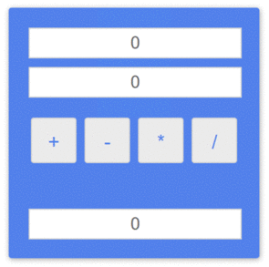
  
</div>

در پایان توجه داشته باشید که برای عمده تغییرات، نیازی به زدن‫ Ctrl + F5 نیست، و کمی بعد از ذخیره سازی تغییرات با Ctrl + S، در همان مرورگری که در حال تست بودید، می‌توانید تغییرات را مشاهده کنید. البته اگر تغییر مدنظرتان را مشاهده نکردید، از Ctrl + F5 استفاده کنید.
