<div dir="rtl">
  
## جلسه پنجم- پیاده سازی صفحه Login
  
در این جلسه قصد داریم صفحه Login پروژه اصلی این دوره (TaskManagement) را به صورت Responsive پیاده سازی کنیم.

در گذشته کاربران فقط از طریق Desktop computer ها به وب‌سایت‌ها دسترسی پیدا می‌کردند. اکثرا هم مانیتورهای یکسانی داشتند، اما امروزه کاربران از طریق دستگاه‌های متفاوت با صفحه نمایش‌های چند اینچ تا ۲۷ اینچ یا حتی بیشتر، به وب‌سایت‌ها دسترسی پیدا می‌کنند و به طبع این کاربران انتظار دارند، وب‌‌سایتی که از آن بازدید می‌کنند با دستگاه مورد استفاده‌شان سازگاری داشته باشد. بدین ترتیب امروزه اکثر وب‌سایت‌ها به صورت Responsive پیاده سازی می‌شوند تا صفحات وب در تمامی دستگاه‌هایی که امکان دسترسی به اینترنت و باز کردن مرورگر را دارند اعم از لپ‌تاپ، تبلت، موبایل، جلوه خوبی داشته باشند.

معمولا در تیم‌های برنامه نویسی روال کار به این صورت است که در ابتدا طراحی پروژه توسط تیم UI / UX انجام شده و سپس خروجی نهایی به توسعه دهنده جهت پیاده‌سازی پروژه داده می‌شود.

Figma یکی از ابزارهای قدرتمند و پرکاربرد طراحی صفحات وب است که در مرورگر اجرامی‌شود.
  
تصویر زیر مربوط به طراحی صفحه لاگین در Figma، در سه سایز  Desktop ، Tablet و Mobile می‌باشد.

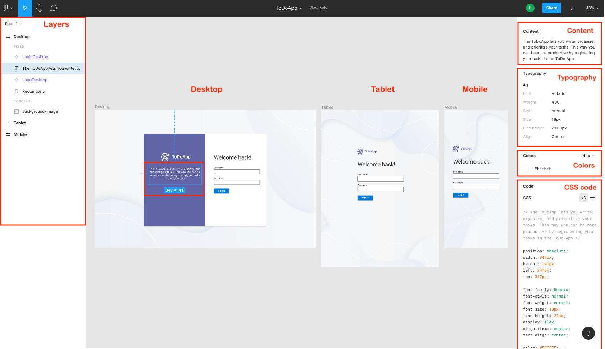
  
همان‌طور که در تصویر می‌بینید، در سایز دسکتاپ، ما دو بخش را داریم که در قسمت سمت راست، فرم Login  قرار گرفته  است و در سمت چپ، لوگو محصول، و همچنین توضیح کوتاهی در مورد محصول قرار گرفته است. در سایز تبلت به دلیل کمبود فضا بخش اصلی که فرم Login است نگه داشته شده، همچنین لوگو مربوط به پروژه هم به قسمت بالای فرم Login و با رنگی متفاوت از لوگو در سایز دسکتاپ قرار گرفته است و در نهایت در سایز موبایل، به دلیل برابری تقریبی سایز صفحه نمایش موبایل با باکس سفید، باکس سفید هم حذف شده است.

شما در Figma  می‌توانید با کلیک بر روی هر المنت و یا کلیک بر روی لایه المنت مورد نظر، در سمت چپ صفحه، به مشخصات المنت، اعم از رنگ، سایز و موارد دیگر، در سمت راست صفحه دسترسی داشته باشید.
لازم به ذکر است بیشترین استفاده ما از این مشخصات مربوط به سایز المنت، رنگ، فونت و فاصله المنت مورد نظر از بقیه اجزای صفحه می‌باشد. لذا، لطفا از کپی کردن کدهای CSS موجود در Figma اجتناب کرده و فقط برای راهنمایی گرفتن و بالا بردن دقت در پیاده‌سازی طرح از این کدها استفاده کنید.
  
ٖهمچنین شما می توانید مطابق تصویر زیر از سمت چپ صفحه، تب Export را انتخاب و آیکن‌ها، لوگو و تمامی تصاویر موجود در طرح مربوط به پروژه را با هر نام و فرمتی که می‌خواهید دانلود نمایید.  

  
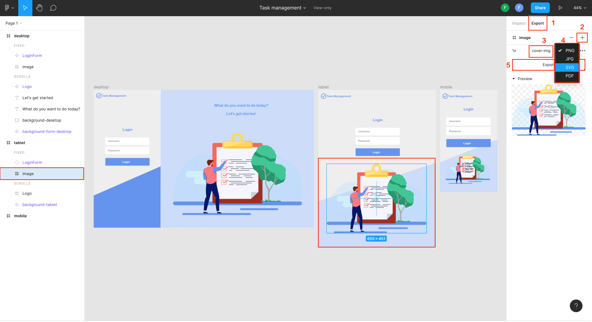
 
در ادامه به منظور پیاده‌سازی طرح داخل Figma ، پروژه‌ای به نام  TaskManagement ایجاد می‌کنیم. پوشه‌ها فایل‌ها و کدهای اضافی را همانند جلسات گذشته حذف می‌کنیم.

از این جلسه به بعد می‌خواهیم از فریم ورک ‌Bit برای ایجاد سریع‌تر و آسان‌تر المنت‌ها استفاده کنیم. 


برای نصب این فریم‌ورک، همانند نصب Delegate.SassBuilder در جلسه گذشته از بخش Solution Explorer بر روی Dependencies کلیک راست کرده و از منوی باز شده گزینه Manage NuGet Packages را انتخاب و در تب ‌Browse در قسمت سرچ باکس bit.client.web.blazor را جستجو و نصب کنید.

سپس خط زیر را که مربوط به کدهای CSS این فریم ورک می‌باشد به تگ head  داخل فایل index.html در پوشه wwwroot اضافه می‌کنیم.
  
  <div dir="ltr">

  ```razor
    
    <link rel="stylesheet" href="_content/Bit.Client.Web.BlazorUI/styles/styles.min.css" asp-append-version="true" />
    
  ``` 
  </div>

و خط زیر را هم که مربوط به کدهای JavaScript این فریم ورک می‌باشد را به انتهای تگ body در این فایل اضافه می‌کنیم.  
 
  <div dir="ltr">

  ```razor
    
    <script src="_content/Bit.Client.Web.BlazorUI/scripts/bit.client.web.js" asp-append-version="true"></script>
    
  ``` 
  </div>

کدهای داخل فایل index.html  بعد از افزودن دو خط بالا به صورت زیر می‌باشد.

 <div dir="ltr">

  ```razor
    
    <!DOCTYPE html>
    <html>

      <head>
          <meta charset="utf-8" />
          <meta name="viewport" content="width=device-width, initial-scale=1.0, maximum-scale=1.0, user-scalable=no" />
          <title>TaskManagement</title>
          <base href="/" />
          <link rel="stylesheet" href="_content/Bit.Client.Web.BlazorUI/styles/styles.min.css" asp-append-version="true" />
          <link href="TaskManagement.styles.css" rel="stylesheet" />
      </head>

      <body>
          <div id="app">Loading...</div>

          <script src="_framework/blazor.webassembly.js"></script>
          <script src="_content/Bit.Client.Web.BlazorUI/scripts/bit.client.web.js" asp-append-version="true"></script>
      </body>

    </html>

  ``` 
  </div>

بعد از اتمام مراحل نصب به ساختار پروژه برمی‌گردیم، در پوشه pages  فایل جدیدی به نام Login.razor ایجاد کرده و کد زیر را به منظور ایجاد ساختار اصلی پروژه در این فایل وارد نمایید.

  <div dir="ltr">

  ```razor
    @page "/login"

    <div class="container">
        <div class="card product-description">
            
            <p>
                Task management is more than a to-do list.
                It means tracking tasks from beginning to end, delegating subtasks to teammates,
                and setting deadlines to make sure projects get done on time.
            </p>
        </div>
        <div class="hidden-desktop">
            
        </div>
        <div class="card login-form">
            <h1>
                Welcome back!
            </h1>
            <form>
                <BitTextField Type="TextFieldType.Text" Placeholder="Username" Class="m-b-20"/>
                <BitTextField Type="TextFieldType.Password" Placeholder="Password" Class="m-b-20"/>
                <BitButton>
                    Sign in
                </BitButton>
            </form>
        </div>
    </div>

  ``` 
  </div>
  
  برای توضیح بهتر کد بالا، بگذارید از تصویر طرح صفحه Login، در سایز دسکتاپ، استفاده کنیم.

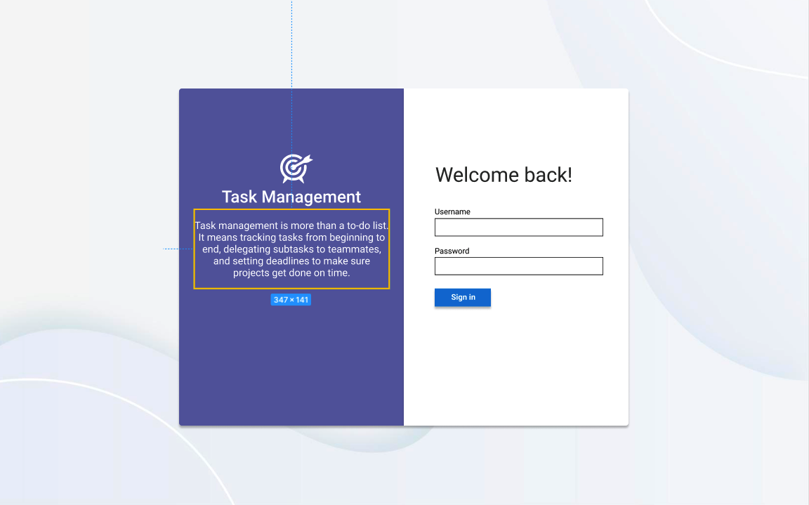

تگ div  با کلاس container مربوط به پس زمینه رنگی می‌باشد که در پشت همه المنت‌های داخل صفحه قرار دارد.

از تگ div با دو کلاس card, product-description  برای ایجاد بخشی که به رنگ بنفش است استفاده کرده‌ایم.

داخل همین div از تگ img برای نمایش لوگو مربوط به سایز دسکتاپ استفاده کرده‌ایم. 

نکته: دقت کنید که همیشه ویژگی alt مربوط به تگ img را مقداردهی نمایید، چرا که اگر کاربر به دلایلی نتواند تصویر را مشاهده کند (به دلیل اتصال کند ، خطا در ویژگی src و … ) ، مقداری که به ویژگی alt اختصاص داده‌اید به جای آن تصویر نمایش داده می‌شود.

از تگ p در HTML  برای تعریف یک پاراگراف استفاده می‌کنیم. در این جا هم ما توضیحات مربوط به این پروژه را داخل این تگ قرار داده‌ایم.

از تگ div با کلاس card, login-form  برای ایجاد قسمت سفید رنگ مربوط به فرم لاگین استفاده می‌کنیم.

از تگ‌های h1 تا h6 برای تعریف عناوین در HTML استفاده می‌کنیم. تگ h1  مهمترین عنوان و تگ h6، عنوان با کمترین درجه اهمیت در صفحه را تعریف می‌کند.

تگ form،  یک فرم را در HTML  تعریف می‌کند. تگ form می‌تواند شامل تگ‌های input برای گرفتن اطلاعات از کاربر مانند Username, Password باشد که در نهایت کاربر را قادر می‌سازد اطلاعاتی را که از طریق این ورودی‌ها وارد کرده است را، به یک وب سرور ارسال کند.

در کد بالا مربوط به صفحه Login، داخل تگ form، ما از دو کامپوننت‌ BitTextField فریم‌ورک Bit برای ایجاد دو ورودی مربوط به Username و Password و از کامپوننت BitButton برای ایجاد دکمه Sign in استفاده کرده‌ایم.

هر کدام از این کامپوننت‌ها یک جز از صفحه وب را تشکیل می‌دهند. این کامپوننت‌ها تشکیل شده از کدهای HTML ،CSS و #C می‌باشند.  

برای درک بهتر این کامپوننت‌ها پروژه را اجرا و وارد محیط Developer Tools  می‌شویم.

در تب Elements  شما می‌توانید نتیجه کامپایل کامپوننت‌های ‌‌Bit را به کدهای HTML مشاهده نمایید. همانطور که در تصویر زیر می‌بینید کامپوننت BitTextField تشکیل شده از یک تگ div است که در میان آن یک تگ input قرار گرفته است.
همچنین این تگ، شامل تعداد کلاس از جمله کلاس bit-txt-fluent می‌باشد. همانطور که در سمت راست محیط Developer Tools مشاهده می‌کنید با استفاده از این کلاس‌ها، استایل‌هایی به این کامپوننت اختصاص داده شده است.
 
 


هر کدام از این کامپوننت‌ها شامل تعدادی Property هستند.
مثلا در کامپوننت ‌BitTextField، ما پراپرتی‌های Type, Placeholder, Class را داریم که مانند attribute ها در کدهای HTML، استفاده می‌شوند. مقادیری را که به این پراپرتی‌ها اختصاص ‌می‌دهیم به کامپوننت پاس داده شده و در جای مناسب خود قرار می‌گیرند.

تصویر زیر محل قرار گرفتن پراپرتی های پاس داده شده به کامپوننت ‌BitTextField را در کد کامپایل شده این کامپوننت نشان می‌دهد.


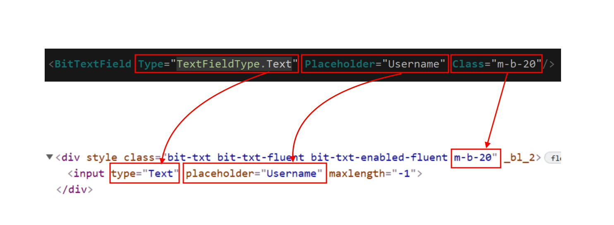

تا این جای کار ما ساختار صفحه Login را ایجاد کرده‌ایم. در ادامه برای افزودن استایل‌ها فایل جدیدی به نام Login.razor.scss  ایجاد می کنیم.

در ابتدای این فایل، متغیرهای رنگ را، بر اساس کد رنگ‌های استفاده شده در طراحی این صفحه داخل فیگما، تعریف می‌کنیم.

<div dir="ltr">

  ```scss
    // Variables
    //
    // Color system
    $white: #fff !default;
    $purple: #6264A7 !default;
    $light-gray: #aaa !default;
    $dark-gray: #333 !default;

  ```

</div>

قبل از اختصاص پراپرتی‌ها به کلاس container، لازم است بدانید که ما برای Layout صفحه از Flexbox در CSS استفاده می‌کنیم. البته روش‌های متفاوتی برای چیدمان المنت‌ها در صفحات وب وجود دارد اما Flexbox یک مدل مدرن‌تر و هوشمندانه‌تر را در مقایسه با روش های قدیمی‌تر ارائه می‌دهد.
  
  در ادامه به div  با کلاس container پراپتی‌های زیر را اختصاص می‌دهیم.

<div dir="ltr">

  ```scss
   .container {
      display: flex;
      flex-direction: row;
      justify-content: center;
      align-items: center;
      width: 100vw;
      height: 100vh;
      background-image: url("./images/background-image.png");
      background-size: cover;
      background-repeat: no-repeat;
  }

  ```
</div>  
  
با استفاده از ویژگی display نحوه نمایش یک  element را در صفحه مشخص می‌کنیم. این مشخصه مقادیر متفاوتی را می‌تواند به خود بگیرد. 
در اینجا ما برای پیاده سازی طرح صفحه براساس مدل Flexbox احتیاج داریم یک المنت والد را به عنوان container در نظر گرفته و پراپرتی display:flex  را به آن اختصاص دهیم.

Flexbox پراپرتی به نام flex-direction دارد که مشخص می کند المنت‌های فرزند در چه جهتی قرار بگیرند. به عنوان مثال اگر مقدار row  را به این پراپرتی اختصاص دهیم المنت‌های فرزند در یک سطر قرار می‌گیرند.

تصویر زیر چهار مقدار اصلی را که این پراپرتی می‌تواند داشته باشد را با چهار شکل بیان می‌کند.

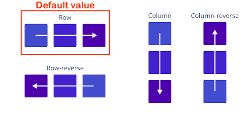

با استفاده از پراپرتی justify-content در FlexBox محل قرار گرفتن المنت‌های فرزند در محور اصلی یا طول المنت والد، مشخص می کنیم.

با استفاده از پراپرتی align-items در FlexBox محل قرار گرفتن المنت‌های فرزند در محور عمودی یا عرض المنت والد، مشخص می کنیم.

برای درک بهتر، تصویر زیر تفاوت بین پراپرتی justify-content و align-items را در FlexBox نشان می‌دهد.

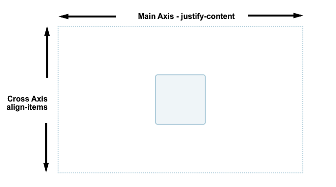

بدیهی است که چون ما هر دو این پراپرتی‌ها را،  center مقداردهی کرده‌ایم، المنت‌های فرزند در مرکز المنت والد قرار میگیرند.

همانطور که در کد بالا می‌بینید ما برای تعیین عرض این المنت با کلاس container از واحد vw و برای تعیین ارتفاع از واحد vh استفاده کرده‌ایم. به این واحدها، واحدهای  Viewport می‌گویند. واحدهای Viewport به نسبت اندازه نمایشگر کار می‌کنند.
 وقتی می‌گوییم 100vw یعنی عرض المنت به اندازه 100% عرض نمایشگر و وقتی می گوییم 100vh یعنی ارتفاع المنت به اندازه 100% ارتفاع صفحه نمایش باشد.

از پراپرتی background-image برای تعیین تصویر پس زمینه المنت استفاده می‌کنیم.

پراپرتی Background-size با مقدار cover باعث می‌شود، تصویر پس‌زمینه به اندازه‌ای که تمام پس زمینه المنت را بتواند بپوشاند تغییر اندازه دهد. 

پراپرتی background-repeat با مقدار no-repeat از تکرار شدن تصویر پس زمینه، زمانی که سایز تصویر کوچکتر از سایز المنت هست جلوگیری می‌کند.

قبل از نوشتن ادامه استایل‌ها، می خواهیم به معرفی ویژگی پرکاربرد Nesting  در SCSS ، بپردازیم و در ادامه ، از این ویژگی استفاده کنیم.

با استفاده از این ویژگی شما می توانید به جای تکرار مجدد همان سلکتورها، یک سلکتور را داخل سلکتور دیگر، به صورت تو در تو بنویسید.

برای درک بهترین این ویژگی به مقایسه دو کد، در تصویر زیر توجه نمایید.

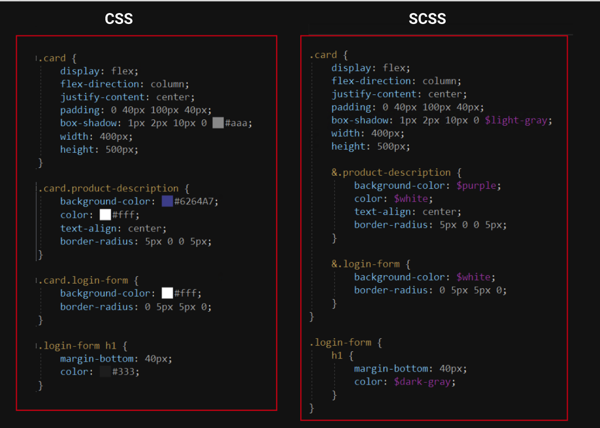
  

همانطور که تصویر بالا می‌بینید، در CSS اگر بخواهیم یک المنتی را انتخاب کنیم که هر دو کلاس را داشته باشد به صورت زیر هر دو کلاس را بدون هیچ فاصله ای پشت هم می نویسیم.

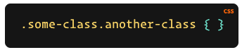

با استفاده از" & " می توانید این انتخاب را در ویژگی Nesting مربوط به SCSS نیز، به صورت زیر انجام دهید.

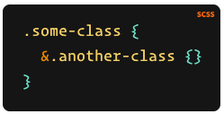

در ادامه نوشته کدهای SCSS، کدهای زیرا را به انتهای کدهای قبلی اضافه نمایید.

<div dir="ltr">

  ```scss
    .card {
        display: flex;
        flex-direction: column;
        justify-content: center;
        padding: 0 40px 100px 40px;
        box-shadow: 1px 2px 10px 0 $light-gray;
        width: 400px;
        height: 500px;

        &.product-description {
            background-color: $purple;
            color: $white;
            text-align: center;
            border-radius: 5px 0 0 5px;
        }

        &.login-form {
            background-color: $white;
            border-radius: 0 5px 5px 0;
        }
    }

    .login-form {
        h1 {
            margin-bottom: 40px;
            color: $dark-gray;
        }
    }

    .m-b-20 {
        margin-bottom: 20px;
    }
    
    .hidden-desktop {
      display: none;
    }

  ```
</div>  

در کلاس hidden-desktop در کد بالا، از پراپرتی display با مقدار none استفاده کرده ایم. از این مقدار در پراپرتی display به منظور پنهان کردن یک المنت می‌توانیم استفاده کنیم. به گونه‌ای که انگار این المنت از ابتدا وجود نداشته است.

از این قسمت به بعد، استایل‌هایی که مینویسم مربوط به نمایش صحیح المنت‌ها در سایز تبلت و موبایل می‌باشد.

کدهای زیر را به ادامه کدهای قبلی اضافه نمایید.

<div dir="ltr">

  ```scss
  /* Media Query for low resolution  Tablets, Ipads */
  @media (min-width: 481px) and (max-width: 767px) {
    .container {
        flex-direction: column;
    }

    .hidden-desktop {
        display: block;
    }

    .card {
        &.product-description {
            display: none;
        }
  
        &.login-form {
            background-color: transparent;
            box-shadow: none;
        }
    }
}

 /* Media Query for Mobile Devices */
 @media (max-width: 480px) {
  
  .container {
        flex-direction: column;
    }

    .hidden-desktop {
        display: block;
    }

    .card {
        padding: 20px;
        width: 300px;
        height: auto;
  
        &.product-description {
            display: none;
        }
  
        &.login-form {
            background-color: transparent;
            box-shadow: none;
        }
    }

}

  ```
</div> 

همانطور که در کد بالا می ‌بینید از media queries برای اعمال استایل‌‌ها بر روی المنت‌ها متناسب با صفحه نمایش‌های تبلت‌ و موبایل‌ استفاده کرده‌ایم. 
  
با استفاده از بررسی عرض صفحه نمایش در media queries می‌توانیم استایل‌های متناسب با هر اندازه از صفحه نمایش را، به المنت‌ها اضافه، تغییر و یا از آنها حذف نماییم. 

به منظور مطمئن شدن از صحیح بودن نمایش المنت‌ها در دستگاه‌ها و یا صفحه نمایش‌های متفاوت، می‌توانید مطابق تصویر زیر، از محیط developer tools، بر روی Toggle device toolbar کلیک کرده و از بالای صفحه داخل مرورگر، سایز صفحه نمایش و یا نوع device خود را انتخاب نمایید.

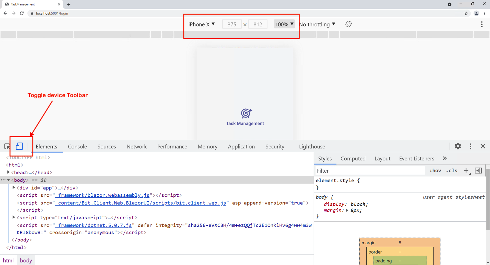
  

در ادامه فایل جدیدی به نام Login.razor.cs ایجاد می‌کنیم.
  
در این مرحله، می‌خواهیم دو مقداری را که توسط ورودی‌ها به عنوان UserName و Password از کاربر گرفته‌ایم را با یک مقدار فرضی مثلا "test" مقایسه و در صورت مخالف بودن با این مقدار، متغیر IsMessageBarVisible
که  از نوع boolean می باشد و به صورت پیش فرض با false مقدار دهی شده را، با مقدار true و در غیر این صورت با مقدار false مقداردهی کنیم.
  

<div dir="ltr">

  ```c#
    using System;
    using System.Collections.Generic;
    using System.Linq;
    using System.Threading.Tasks;

    namespace TaskManagement.Pages
    {
        public partial class Login
        {
            public string UserName { get; set; }
            public string Password { get; set; }

            public bool IsMessageBarVisible = false;

            public void Signin()
            {
                if (UserName != "test" || Password != "test") {
                    IsMessageBarVisible = true;
                } else
                {
                    IsMessageBarVisible = false;
                }
            }
        }
    }

  ``` 
  </div>
  
  در #C یک متغیر از نوع boolean با کلمه کلیدی bool تعریف می‌شود و فقط می تواند شامل دو مقدار true  و false باشد.

عملگر منطقی  || یا OR به این شکل عمل می‌کند که اگر تنها یکی از عبارات یا شرط ها درست باشد مقدار true را برمی گرداند.

در کد بالا داخل بلاک کد if ، ما می‌گوییم اگر نام کاربری " یا " رمز عبور  مخالف مقدار test بود متغیر IsMessageBarVisible  با true مقداردهی شود.

در مرحله آخر می‌خواهیم از پارامترها و متد تعریف شده در این فایل، در فایل Login.razor استفاده کنیم.

<div dir="ltr">

  ```razor
    @page "/login"

    <div class="container">
        <div class="card product-description">
            
            <p>
                Task management is more than a to-do list.
                It means tracking tasks from beginning to end, delegating subtasks to teammates,
                and setting deadlines to make sure projects get done on time.
            </p>
        </div>
        <div class="hidden-desktop">
            
        </div>
        <div class="card login-form">
            <h1>
                Welcome back!
            </h1>
            <form onsubmit="return false;">

                @if (IsMessageBarVisible)
                {
                    <BitMessageBar MessageBarStyle="@MessageBarStyle.Error">
                        Username and password entered incorrectly.
                    </BitMessageBar>
                }

                <div>
                    <label for="username">Username</label>
                    <input type="text" placeholder="Username" name="username" @bind="@UserName" />
                </div>

                <div>
                    <label for="passowrd">Password</label>
                    <input type="text" placeholder="Password" name="passowrd" @bind="@Password" />
                </div>

                <BitButton OnClick="Signin">
                    Signin
                </BitButton>

            </form>
        </div>
    </div>

  ``` 
  </div>

همان طور که در کد بالا می‌بینید از متغیر IsMessageBarVisible برای نشان دادن پیغامی مبنی بر نادرست بودن UserName و Password استفاده کرده‌ایم. بدین صورت که در صورت true  بودن IsMessageBarVisible با استفاده از کامپوننت BitMessageBar در فریم ورک ‌Bit این پیغام را نمایش می‌دهیم.

کامپوننت BitMessageBar دارای پراپرتی MessageBarStyle می باشد که اگر با MessageBarStyle.Error@ مقدار دهی شود، پیغام ما مانند تصویر زیر، استایل یک پیغامی که جنبه‌ی خطا دارد را، به خود می‌گیرد.

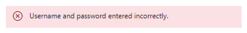

</div>
