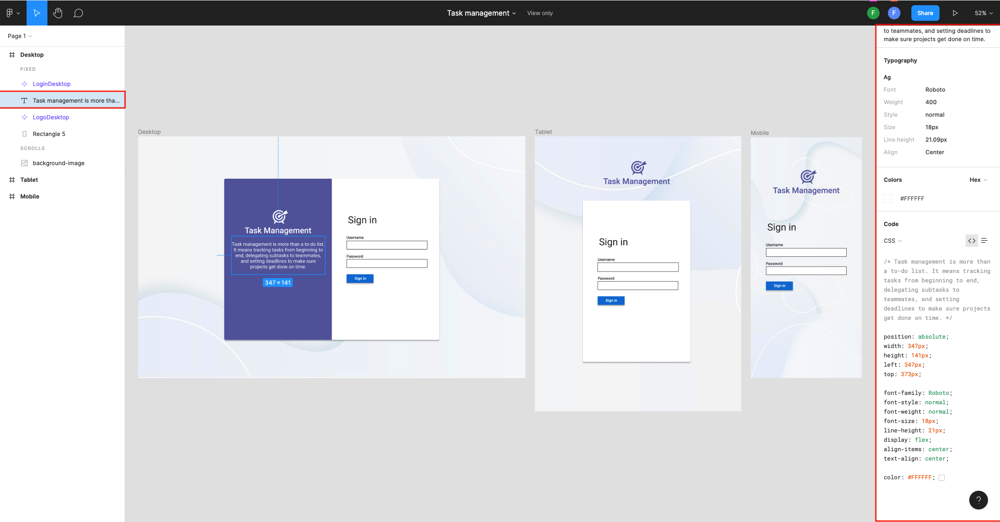
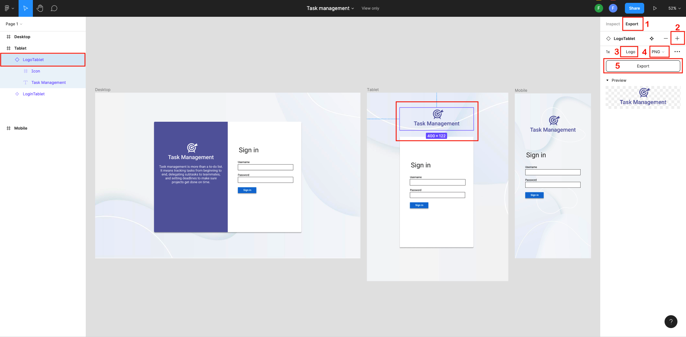

<div dir="rtl">
  
## جلسه پنجم- پیاده سازی صفحه Login
  
در این جلسه قصد داریم صفحه Login پروژه اصلی این دوره (TaskManagement) را به صورت responsive پیاده سازی کنیم.

در زمان نه چندان دور کاربران فقط از طریق desktop computer ها به وب‌سایت‌ها دسترسی پیدا می‌کردند. اکثرا هم مانیتورهای یکسانی داشتند، اما امروزه کاربران از طریق دستگاه‌های متفاوت با صفحه نمایش‌های چند اینچ تا ۲۷ اینچ یا حتی بیشتر، به وب‌سایت‌ها دسترسی پیدا می‌کنند و به طبع این کاربران انتظار دارند، وب‌‌سایتی که از آن بازدید می‌کنند با دستگاه مورد استفاده‌شان سازگاری داشته باشد. بدین ترتیب امروزه اکثر وب‌سایت‌ها به صورت responsive پیاده سازی می‌شوند تا صفحات وب در تمامی دستگاه‌هایی که امکان دسترسی به اینترنت و باز کردن مرورگر را دارند اعم از لپ‌تاپ، تبلت، موبایل، جلوه خوبی داشته باشند.

معمولا در تیم‌های برنامه نویسی روال کار به این صورت است که در ابتدا طراحی پروژه توسط تیم UI / UX انجام شده و سپس خروجی نهایی به توسعه دهنده جهت پیاده‌سازی پروژه داده می‌شود.

دوستان ما در تیم UI / UX، برای طراحی صفحات وب از ابزاری به نام Figma استفاده می کنند. Figma یک ابزار طراحی قدرتمند است که در مرورگر اجرا می‌شود و به شما در ایجاد وب‌سایت‌ها، لوگوها، آیکن‌ها کمک می‌کند.

تصویر زیر مربوط به طراحی صفحه لاگین در Figma در سه سایز desktop, tablet, mobile می‌باشد.


  
همان‌طور که در تصویر می‌بینید، در سایز دسکتاپ، ما دو بخش را داریم که در قسمت سمت راست، فرم Login  قرار گرفته  است و در سمت چپ، لوگو محصول، و همچنین توضیح کوتاهی در مورد محصول قرار گرفته است. در سایز تبلت به دلیل کمبود فضا بخش اصلی که فرم Login است نگه داشته شده، همچنین لوگو مربوط به پروژه هم به قسمت بالای فرم Login و با رنگی متفاوت از لوگو در سایز دسکتاپ قرار گرفته است و در نهایت در سایز موبایل، به دلیل برابری تقریبی سایز صفحه نمایش موبایل با باکس سفید، باکس سفید هم حذف شده است.

شما در Figma  می‌توانید با کلیک بر روی هر المنت و یا کلیک بر روی لایه المنت مورد نظر، در سمت چپ صفحه، به مشخصات المنت، اعم از رنگ، سایز و موارد دیگر، در سمت راست صفحه دسترسی داشته باشید.
لازم به ذکر است بیشترین استفاده ما از این مشخصات مربوط به سایز المنت، رنگ، فونت و فاصله المنت مورد نظر از بقیه اجزای صفحه می‌باشد. لذا، لطفا از کپی کردن کدهای CSS موجود در Figma اجتناب کرده و فقط برای راهنمایی گرفتن و بالا بردن دقت در پیاده‌سازی طرح از این کدها استفاده کنید.
  
همچنین شما می توانید مطابق تصویر زیر از سمت چپ صفحه، تب Export ، آیکن‌ها، لوگو و تمامی تصاویر موجود در طرح مربوط به پروژه را با هر نام و فرمتی که می‌خواهید دانلود نمایید. 

  

 
پروژه‌ای جدید به نام  TaskManagement ایجاد کرده و فایل‌ها، کدها و پوشه‌های اضافی را همانند جلسات گذشته حذف کنید.

در پوشه pages  فایل جدیدی به نام Login.razor  ایجاد کرده و در ابتدای این فایل کد زیر را وارد نمایید. 

 <div dir="ltr">

  ```razor
    @page "/login"
  ```
</div>
  
 به منظور مطمئن شدن از درستی ساده سازی ساختار، پروژه را اجرا کنید.

از این جلسه به بعد می‌خواهیم از فریم ورک ‌Bit برای ایجاد سریع‌تر و آسان‌تر element ها استفاده کنیم. بدین منظور همانند نصب Delegate.SassBuilder در جلسه گذشته از بخش Solution Explorer بر روی Dependencies کلیک راست کرده و از منوی باز شده گزینه Manage NuGet Packages را انتخاب و در تب ‌‌Browse در قسمت سرچ باکس bit.client.web.blazor را جستجو و نصب کنید.
  
</div>
