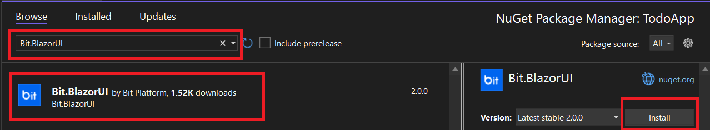

<div dir="rtl">
  
## جلسه پنجم- پیاده سازی صفحه Login
  
در این جلسه قصد داریم صفحه Login پروژه اصلی این دوره (TodoApp) را به صورت Responsive پیاده سازی کنیم.

منظور از پیاده‌سازی به صورت Responsive، این است که ما در پیاده‌سازی صفحه وب به گونه‌ای عمل کنیم که المنت‌‌های موجود در صفحه، در تمامی دستگاه‌هایی که مد نظر ما هستند اعم از لپ‌تاپ، تبلت و موبایل به درستی نمایش داده شوند. به عنوان مثال اگر برای باز کردن صفحه‌ای از وب به جای مرورگر لپ‌تاپ، از مرورگر موبایل استفاده کردیم برای خواندن متن موجود در صفحه احتیاج به زوم کردن متن نداشته باشیم و یا برای دیدن کامل محتوای صفحه، مجبور به اسکرول کردن صفحه به صورت افقی نباشیم.


## لیست موضوعات  
1. [آشنایی با Figma](#Figma)
2. [استفاده از فریم ورک Bit برای ایجاد المنت ها](#BitComponents)
3. [نمایش صحیح المنت ها در سایز تبلت و موبایل](#TabletAndMobile)
4. [پردازش ورودی ها و نمایش پیغام مناسب](#ProcessInput)
  
## آشنایی با Figma <a name="Figma"></a>
  
قبل از شروع به پیاده سازی صفحه Login می‌خواهیم به بررسی طرح این این صفحه، که از قبل، توسط تیم طراحی به وسیله ابزاری به نام Figma ایجاد شده است بپردازیم.
  
همان‌طور که در تصویر زیر می‌بینید، این صفحه در سه سایز Tablet ،Desktop و Mobile  طراحی شده است. 

در سایز دسکتاپ، بخش مربوط به Login کاربر، از دو بخش تشکیل شده است، که در یک بخش، فرم Login قرار گرفته و در بخش بعدی، لوگوی محصول به اضافه توضیح کوتاهی در مورد محصول قرار گرفته است. 

در سایز تبلت و موبایل به دلیل کمبود فضا بخش اصلی، که همان فرم Login است نگه داشته شده است و همچنین لوگوی مربوط به پروژه هم به قسمت بالای فرم Login با رنگی متفاوت از لوگو، در سایز دسکتاپ قرار گرفته است.

زمانی که طراح، طرح صفحه موجود را داخل Figma  به شما می‌دهد، شما می‌توانید با کلیک بر روی هر المنت و یا کلیک بر روی لایه المنت مورد نظر، به مشخصات المنت، در سمت راست صفحه، که شامل رنگ، سایز و موقعیت المنت در صفحه است، دسترسی داشته باشید.
  
لازم به ذکر است بیشترین استفاده ما از این مشخصات مربوط به سایز المنت، رنگ، فونت و فاصله المنت مورد نظر از بقیه اجزای صفحه می‌باشد. لذا، لطفا از کپی کردن کدهای CSS موجود در Figma اجتناب کرده و فقط برای راهنمایی گرفتن و بالا بردن دقت در پیاده‌سازی طرح، از این کدها استفاده کنید.

<br></br>

<br></br>

ٖهمچنین شما می توانید مطابق تصویر زیر، تب Export را انتخاب و آیکن‌ها، لوگو و تمامی تصاویر موجود در طرح مربوط به پروژه را با هر نام و فرمتی که می‌خواهید دانلود نمایید.  

  


از طریق لینک زیر می‌توانید به طرح بالا در فیگما دسترسی داشته باشید.

https://www.figma.com/file/q0ldEdrilGhZMs7Nj2vZe3/ToDoApp

## استفاده از فریم ورک Bit برای ایجاد المنت ها <a name ="BitComponents"></a>

در ادامه پروژه‌ای به نام TodoApp ایجاد کرده و همانند [جلسات گذشته](https://github.com/bitfoundation/virtual-academy/tree/main/web/step-03) پوشه‌ها، فایل‌ها و کدهای اضافی را حذف می‌کنیم.
  
از این جلسه به بعد می‌خواهیم از کامپوننت‌های ‌Bit برای ایجاد سریع‌تر و آسان‌تر المنت‌ها استفاده کنیم.
  
برای نصب Bit، همانند [نصب Delegate.SassBuilder در جلسه گذشته](https://github.com/bitfoundation/virtual-academy/tree/main/web/step-04#%D8%A7%D9%81%D8%B2%D9%88%D8%AF%D9%86-%D8%A7%D8%B3%D8%AA%D8%A7%DB%8C%D9%84-%D8%A8%D8%A7%D8%A7%D8%B3%D8%AA%D9%81%D8%A7%D8%AF%D9%87-%D8%A7%D8%B2-scss-) از بخش Solution Explorer بر روی Dependencies کلیک راست کرده و از منوی باز شده گزینه Manage NuGet Packages را انتخاب و در تب ‌Browse در قسمت سرچ باکس Bit.Client.Web.BlazorUI را جستجو و نصب کنید.



سپس خط زیر را که مربوط به کدهای CSS این کامپوننت‌ها می‌باشد به تگ head  داخل فایل index.html در پوشه wwwroot اضافه می‌کنیم.
  
  <div dir="ltr">

  ```razor
    
    <link rel="stylesheet" href="_content/Bit.Client.Web.BlazorUI/styles/styles.min.css"/>
    
  ``` 
  </div>

و خط زیر را هم که مربوط به کدهای JavaScript این کامپوننت‌ها می‌باشد را به انتهای تگ body در این فایل اضافه می‌کنیم.  
 
  <div dir="ltr">

  ```razor
    
    <script src="_content/Bit.Client.Web.BlazorUI/scripts/bit.client.web.js"></script>
    
  ``` 
  </div>

کدهای داخل فایل index.html  بعد از افزودن دو خط بالا به صورت زیر می‌باشد.

 <div dir="ltr">

  ```razor
    
    <!DOCTYPE html>
    <html>

      <head>
          <meta charset="utf-8" />
          <meta name="viewport" content="width=device-width, initial-scale=1.0, maximum-scale=1.0, user-scalable=no" />
          <title>TodoApp</title>
          <base href="/" />
          <link rel="stylesheet" href="_content/Bit.Client.Web.BlazorUI/styles/styles.min.css"/>
          <link href="TodoApp.styles.css" rel="stylesheet"/>
      </head>

      <body>
          <div id="app">Loading...</div>

          <script src="_framework/blazor.webassembly.js"></script>
          <script src="_content/Bit.Client.Web.BlazorUI/scripts/bit.client.web.js"></script>
      </body>

    </html>

  ``` 
  </div>
  
و همچنین خط زیر را هم که مربوط به فضای نام Bit BlazorUI است به فایل Imports.razor_ اضافه میکنیم
 
  <div dir="ltr">

  ```razor
    
    @using Bit.Client.Web.BlazorUI
    
  ``` 
  </div>

بعد از اتمام مراحل نصب به ساختار پروژه برمی‌گردیم، در پوشه pages  فایل جدیدی به نام Login.razor ایجاد کرده و کد زیر را به منظور ایجاد ساختار اصلی پروژه در این فایل وارد نمایید.

  <div dir="ltr">

  ```razor
    @page "/login"

    <div class="container">
        <div class="card product-description">
            
            <p>
                The TodoApp lets you write, organize, and prioritize your tasks.
                This way you can be more productive by registering your tasks in the Todo App
            </p>
        </div>
        <div class="card login-form">
            
            <h1>
                Welcome back!
            </h1>
            <form>
                <BitTextField Type="TextFieldType.Text" Label="Username" Class="text-field" />
                <BitTextField Type="TextFieldType.Password" Label="Password" Class="text-field" />
                <BitButton OnClick="Signin">
                  Sign in
                </BitButton>
            </form>
        </div>
    </div>

  ``` 
  </div>
  
  برای توضیح بهتر کد بالا، بگذارید از تصویر طرح صفحه Login، در سایز دسکتاپ، استفاده کنیم.


<br></br>

تگ div  با کلاس container مربوط به پس زمینه رنگی می‌باشد که در پشت همه المنت‌های داخل صفحه قرار دارد.

از تگ div با دو کلاس card, product-description  برای ایجاد بخشی که به رنگ بنفش است استفاده کرده‌ایم.

داخل همین div از تگ img برای نمایش لوگو مربوط به سایز دسکتاپ استفاده کرده‌ایم. دقت داشته باشید که ویژگی alt مربوط به تگ img را همیشه مقداردهی کنید، چرا که اگر کاربر به دلایلی نتواند تصویر را مشاهده کند (اتصال کند، خطا در ویژگی src و … ) ، مقداری که به ویژگی alt اختصاص داده‌اید به جای آن تصویر نمایش داده می‌شود.

از تگ p در HTML  برای تعریف یک پاراگراف استفاده می‌کنیم. در این جا هم ما توضیحات مربوط به این پروژه را داخل این تگ قرار داده‌ایم.

از تگ div با کلاس card, login-form  برای ایجاد قسمت سفید رنگ مربوط به فرم لاگین استفاده می‌کنیم.

از تگ‌های h1 تا h6 برای تعریف عناوین در HTML استفاده می‌کنیم. تگ h1  مهمترین عنوان، و تگ h6، عنوان با کمترین درجه اهمیت در صفحه را تعریف می‌کند.

تگ form،  یک فرم را در HTML  تعریف می‌کند. تگ form می‌تواند شامل تگ‌های input برای گرفتن اطلاعات از کاربر مانند Username, Password باشد که در نهایت کاربر را قادر می‌سازد اطلاعاتی را که از طریق این ورودی‌ها وارد کرده است را، به یک وب سرور ارسال کند.

در کد بالا مربوط به صفحه Login، داخل تگ form، ما از دو کامپوننت‌ BitTextField فریم‌ورک Bit برای ایجاد دو ورودی مربوط به Username و Password و از کامپوننت BitButton برای ایجاد دکمه Sign in استفاده کرده‌ایم.

هر کدام از این کامپوننت‌ها یک جز از صفحه وب را تشکیل می‌دهند. این کامپوننت‌ها تشکیل شده از کدهای HTML ،CSS و #C می‌باشند.  

برای درک بهتر این کامپوننت‌ها پروژه را اجرا و وارد محیط Developer Tools می‌شویم. در تب Elements شما می‌توانید نتیجه کامپایل کامپوننت‌های ‌Bit به کدهای HTML را مشاهده کنید. همانطور که در تصویر زیر می‌بینید کامپوننت BitTextField تشکیل شده از یک تگ div است که در میان آن یک تگ input قرار گرفته است. همچنین این تگ، شامل تعداد کلاس از جمله کلاس bit-txt-fluent می‌باشد که اگر دقت کنید در سمت راست محیط Developer Tools بخش مربوط به استایل‌ها، با استفاده از این کلاس‌ها، استایل‌هایی به این کامپوننت‌ها اختصاص داده شده است.
<br></br>

<br></br>
هر کدام از این کامپوننت‌ها شامل تعدادی Property هستند.
مثلا در کامپوننت ‌BitTextField، ما پراپرتی‌های bind-Value ,Type, Label, Class@ را داریم که مانند attribute ها در کدهای HTML، استفاده می‌شوند. مقادیری را که به این پراپرتی‌ها اختصاص ‌می‌دهیم به کامپوننت پاس داده شده و در جای مناسب خود قرار می‌گیرند.

تصویر زیر محل قرار گرفتن پراپرتی های پاس داده شده به کامپوننت ‌BitTextField را در کد کامپایل شده این کامپوننت نشان می‌دهد.


تا این جای کار ما ساختار صفحه Login را ایجاد کرده‌ایم.

در ادامه و قبل از شروع به نوشتن کدهای CSS میخواهیم یک CSS RESET به پروژه اضافه کنیم.

قضیه از این قرار است که مرورگرها مجموعه‌ای از استایل‌های پیش‌فرض را برای تگ‌های HTML در نظر میگیرند، این استایل‌های پیش فرض می‌توانند با استایل‌هایی که ما می‌نویسم تداخل پیدا کنند به همین دلیل بهتر است قبل از شروع به کار بر روی کدهای CSS، استایل‌های پیش‌فرض را پاک کنیم و با یک صفحه خالی شروع کنیم. 

به این منظور یک فایل CSS  جدید به نام main.css خارج از سطح کامپوننت‌ها و داخل پوشه wwwroot ایجاد می‌کنیم و آن را به عنوان فایل CSS اصلی در نظر می‌گیریم، این که کدهای مربوط به CSS RESET را داخل این فایل و خارج از سطح کامپوننت‌ها قرار می‌دهیم به این دلیل است که می‌خواهیم این کدها نه تنها بر روی یک کامپوننت، بلکه بر روی تمامی المنت‌ها در صفحه تاثیر بگذارد.


در این مرحله، صفر کردن padding ها و margin های مربوط به تمامی المنت‌ها برای ما کافی‌ست. 

<div dir="ltr">

  ```css
  * {
      padding: 0;
      margin: 0;
  }
  ```

</div>

سلکتور * در CSS به معنای انتخاب تمامی المنت‌ها موجود در صفحه می‌باشد.

سپس برای افزودن استایل‌ها فایل جدیدی به نام Login.razor.scss ایجاد می کنیم.

در ابتدای این فایل، متغیرهای رنگ را، بر اساس کد رنگ‌های استفاده شده در طراحی این صفحه داخل Figma، تعریف می‌کنیم.

<div dir="ltr">

  ```scss
    // Variables
    //
    // Color system
    $white: #fff !default;
    $purple: #6264A7 !default;
    $light-gray: #aaa !default;
    $dark-gray: #333 !default;

  ```

</div>

قبل از اختصاص پراپرتی‌ها به کلاس container، لازم است بدانید، از بین روش‌های متفاوتی که برای چیدمان المنت‌ها (Layout) صفحه وجود دارد، ما روش Flexbox را برای Layout صفحه انتخاب کرده‌ایم.  
  
  در ادامه به div  با کلاس container پراپرتی‌های زیر را اختصاص می‌دهیم.

<div dir="ltr">

  ```scss
   .container {
      display: flex;
      flex-direction: row;
      justify-content: center;
      align-items: center;
      width: 100vw;
      height: 100vh;
      background-image: url("./images/background-image.png");
      background-size: cover;
      background-repeat: no-repeat;
  }

  ```
</div>  
  
با استفاده از ویژگی display نحوه نمایش یک element را در صفحه مشخص می‌کنیم. این مشخصه مقادیر متفاوتی را می‌تواند به خود بگیرد. در اینجا برای پیاده سازی طرح صفحه براساس مدل Flexbox احتیاج داریم یک المنت والد را به عنوان container در نظر بگیریم و به پراپرتی display مقدار flex را اختصاص دهیم.

Flexbox پراپرتی به نام flex-direction دارد که مشخص می کند المنت‌های فرزند در چه جهتی قرار بگیرند. به عنوان مثال اگر مقدار row  را به این پراپرتی اختصاص دهیم المنت‌های فرزند در یک سطر قرار می‌گیرند.

تصویر زیر چهار مقدار اصلی را که این پراپرتی می‌تواند داشته باشد را با چهار شکل بیان می‌کند.


با استفاده از پراپرتی justify-content در FlexBox محل قرار گرفتن المنت‌های فرزند در محور اصلی یا طول المنت والد، مشخص می کنیم.

با استفاده از پراپرتی align-items در FlexBox محل قرار گرفتن المنت‌های فرزند در محور عمودی یا عرض المنت والد، مشخص می کنیم.

برای درک بهتر، تصویر زیر تفاوت بین پراپرتی justify-content و align-items را در FlexBox نشان می‌دهد.


بدیهی است که چون ما هر دو این پراپرتی‌ها را،  center مقداردهی کرده‌ایم، المنت‌های فرزند در مرکز المنت والد قرار میگیرند.

همانطور که در کد بالا می‌بینید ما برای تعیین عرض این المنت با کلاس container از واحد vw و برای تعیین ارتفاع از واحد vh استفاده کرده‌ایم. به این واحدها، واحدهای  Viewport می‌گویند. واحدهای Viewport به نسبت اندازه نمایشگر کار می‌کنند.
 وقتی می‌گوییم 100vw یعنی عرض المنت به اندازه 100% عرض نمایشگر و وقتی می گوییم 100vh یعنی ارتفاع المنت به اندازه 100% ارتفاع صفحه نمایش باشد.

از پراپرتی background-image برای تعیین تصویر پس زمینه المنت استفاده می‌کنیم.

پراپرتی background-size با مقدار cover باعث می‌شود، تصویر پس‌زمینه به اندازه‌ای که تمام پس زمینه المنت را بتواند بپوشاند تغییر اندازه دهد. 

پراپرتی background-repeat با مقدار no-repeat از تکرار شدن تصویر پس زمینه، زمانی که سایز تصویر کوچکتر از سایز المنت هست جلوگیری می‌کند.

قبل از نوشتن ادامه استایل‌ها، می خواهیم به معرفی ویژگی پرکاربرد Nesting در Sass بپردازیم و در ادامه از این ویژگی استفاده کنیم.

با استفاده از این ویژگی شما می توانید به جای تکرار مجدد همان سلکتورها، یک سلکتور را داخل سلکتور دیگر، به صورت تو در تو بنویسید.

برای درک بهتر این ویژگی به مقایسه دو کد، در تصویر زیر توجه نمایید.
<br></br>


  
<br></br>
همانطور که در تصویر بالا می‌بینید، در CSS اگر بخواهیم المنتی را انتخاب کنیم که حتما هر دو کلاس را داشته باشد به صورت زیر هر دو کلاس را بدون هیچ فاصله ای پشت هم می نویسیم.


با استفاده از" & " می توانید این انتخاب را در ویژگی Nesting مربوط به Sass ، به صورت زیر انجام دهید.


در ادامه، کدهای زیر را به انتهای کدهای قبلی اضافه کنید.

<div dir="ltr">

  ```scss
    .card {
        display: flex;
        flex-direction: column;
        padding: 0 40px 100px 40px;
        box-shadow: 1px 2px 10px 0 $light-gray;
        width: 400px;
        height: 500px;

        &.product-description {
            justify-content: center;
            align-items: center;
            background-color: $purple;
            color: $white;
            text-align: center;
            border-radius: 5px 0 0 5px;
        }

        &.login-form {
            justify-content: center;
            align-items: flex-start;
            background-color: $white;
            border-radius: 0 5px 5px 0;
        }

        .logo {
            margin-bottom: 30px;
        }
    }

    .login-form {
        h1 {
            margin-bottom: 30px;
            color: $dark-gray;
        }
    }

    .logo-small {
        display: none;
    }

  ```
</div>  

در کلاس logo-small در کد بالا، از پراپرتی display با مقدار none استفاده کرده ایم. از این مقدار در پراپرتی display به منظور پنهان کردن یک المنت می‌توانیم استفاده کنیم. به گونه‌ای که انگار این المنت از ابتدا وجود نداشته است.

## نمایش صحیح المنت ها در سایز تبلت و موبایل <a name="TabletAndMobile"></a>  
از این قسمت به بعد، استایل‌هایی که مینویسم مربوط به نمایش صحیح المنت‌ها در سایز تبلت و موبایل می‌باشد.

<div dir="ltr">

  ```scss
    /* Media Query for low-resolution Tablets and Mobile Devices*/
    @media (max-width: 768px) {
        .container {
            flex-direction: column;
        }

        .hidden-desktop {
            display: block;
        }

        .card {
            width: auto;
            height: auto;

            &.product-description {
                display: none;
            }

            &.login-form {
                background-color: transparent;
                box-shadow: none;

                .logo-small {
                    display: block;
                }
            }
        }
    }

  ```
</div> 

همانطور که در کد بالا می ‌بینید از media queries برای اعمال استایل‌ها بر روی المنت‌ها متناسب با صفحه نمایش‌های تبلت‌ و موبایل‌ استفاده کرده‌ایم. 
  
با استفاده از بررسی عرض صفحه نمایش در media queries می‌توانیم استایل‌های متناسب با هر اندازه از صفحه نمایش را، به المنت‌ها اضافه، تغییر و یا از آنها حذف نماییم. 

به منظور مطمئن شدن از صحیح بودن نمایش المنت‌ها در دستگاه‌ها و یا صفحه نمایش‌های متفاوت، می‌توانید مطابق تصویر زیر، از محیط developer tools، بر روی Toggle device toolbar کلیک کرده و از بالای صفحه داخل مرورگر، سایز صفحه نمایش و یا نوع device خود را انتخاب نمایید.
<br></br>

<br></br>

## پردازش ورودی ها و نمایش پیغام مناسب <a name="ProcessInput"></a>  
در ادامه فایل جدیدی به نام Login.razor.cs ایجاد می‌کنیم.
  
در این مرحله مطابق فلوچارتی که در تصویر زیر آمده، دو مقداری را که توسط ورودی‌ها به عنوان UserName و Password از کاربر گرفته‌ایم را با یک مقدار فرضی مثلا "test" مقایسه می‌کنیم. در صورت درست بودن نتیجه مقایسه، متغیر Show Login Error Message که از نوع boolean می‌باشد و به صورت پیش فرض با مقدار false مقدار دهی شده را، با مقدار true مقداردهی کرده و در غیر این صورت با مقدار false مقداردهی می‌کنیم. در نهایت هم با بررسی مقدار داده شده به متغیر Show Login Error Message، در صورت true بودن پیغامی مبنی بر معتبر نبودن UserName و Password به کار نمایش می‌دهیم.

<br></br>

<br></br>

<div dir="ltr">

  ```c#
    namespace TodoApp.Pages
    {
        public partial class Login
        {
            public string UserName { get; set; }
            public string Password { get; set; }

            public bool ShowLoginErrorMessage = false;

            public void Signin()
            {
                if (UserName != "test" || Password != "test") 
                {
                    ShowLoginErrorMessage = true;
                } 
                else
                {
                    ShowLoginErrorMessage = false;
                }
            }
        }
    }

  ``` 
  </div>
  
  در #C یک متغیر از نوع boolean با کلمه کلیدی bool تعریف می‌شود و فقط می تواند شامل دو مقدار true  و false باشد.

عملگر منطقی  || یا OR به این شکل عمل می‌کند که اگر تنها یکی از عبارات یا شرط ها درست باشد مقدار true را برمی گرداند.

در کد بالا داخل بلاک کد if ، ما می‌گوییم اگر نام کاربری " یا " رمز عبور  مخالف مقدار test بود متغیر ShowLoginErrorMessage با true مقداردهی شود.

در مرحله آخر می‌خواهیم از پارامترها و متد تعریف شده در این فایل، در فایل Login.razor استفاده کنیم.

<div dir="ltr">

  ```razor
     @page "/login"

    <div class="container">
        <div class="card product-description">
            
            <p>
                The TodoApp lets you write, organize, and prioritize your tasks.
                This way you can be more productive by registering your tasks in the Todo App
            </p>
        </div>
        <div class="card login-form">
            
            <h1>
                Welcome back!
            </h1>
            <form onsubmit="return false;">
                @if (ShowLoginErrorMessage)
                {
                    <BitMessageBar MessageBarType="BitMessageBarType.Error">
                        Username and password entered incorrectly.
                    </BitMessageBar>
                }
                <BitTextField Type="TextFieldType.Text" @bind-Value="@UserName" Label="Username" Class="text-field" />
                <BitTextField Type="TextFieldType.Password" @bind-Value="@Password" Label="Password" Class="text-field" />
                <BitButton OnClick="Signin">
                  Sign in
                </BitButton>
            </form>
        </div>
    </div>

  ``` 
  </div>

همان طور که در کد بالا می‌بینید از متغیر ShowLoginErrorMessage برای نشان دادن پیغامی مبنی بر نادرست بودن UserName و Password استفاده کرده‌ایم. بدین صورت که در صورت true  بودن ShowLoginErrorMessage با استفاده از کامپوننت BitMessageBar در فریم ورک ‌Bit این پیغام را نمایش می‌دهیم.

کامپوننت BitMessageBar دارای پراپرتی MessageBarType می باشد که اگر با BitMessageBarType.Error مقدار دهی شود، پیغام ما مانند تصویر زیر، استایل یک پیغامی که جنبه‌ی خطا دارد را، به خود می‌گیرد.


</div>
