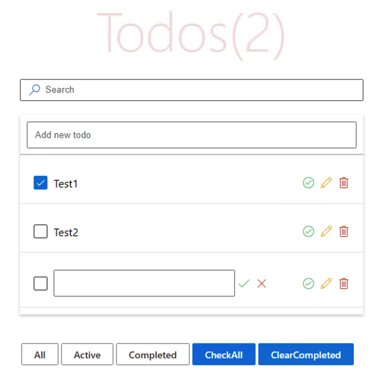
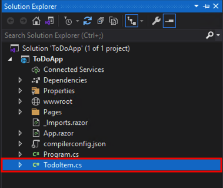

<div dir="rtl">
  
## جلسه ششم- پیاده‌سازی TodoList	
  
در این جلسه می خواهیم به پیاده‌سازی یک TodoList ساده همانند تصویر زیر بپردازیم.



ابتدا در پوشه pages فایل جدیدی به نام TodoPage.razor ایجاد کرده و کد زیر را به منظور تعیین آدرس این صفحه در ابتدای این فایل قرار می دهیم.

<div dir="ltr">

```razor

  @page "/todo";

``` 
</div>

در ادامه فایلی با نام TodoItem.cs به ریشه پروژه اضافه کنید.  



در این فایل قرار است کلاسی به نام TodoItem داشته باشیم که این کلاس شامل فیلدهای مربوط به یک مورد todo می‌باشد. 

<div dir="ltr">

```c#

using System;
using System.Collections.Generic;
using System.Linq;
using System.Threading.Tasks;

    public class TodoItem
    {
        public int Id { get; set; }

        public string Title { get; set; }

        public bool IsDone { get; set; }

        public bool IsEdit { get; set; } = false;
    }

``` 
</div>

همانطور که در کد بالا می بینید قرار است هر کدام از Todo ها، شامل چهار فیلد Id, Title, IsDone و IsEdit  با مقدار پیشفرض  false باشد.

به فایل TodoPage.razor  برمیگردیم.

 ما احتیاج به یک لیست برای نشان دان todo ها داریم. بدین منظور از کامپوننت BitBasicList ، BitFoundation به صورت زیر، استفاده می‌کنیم.

```razor

  @page "/todo";

``` 
</div>

</div>
